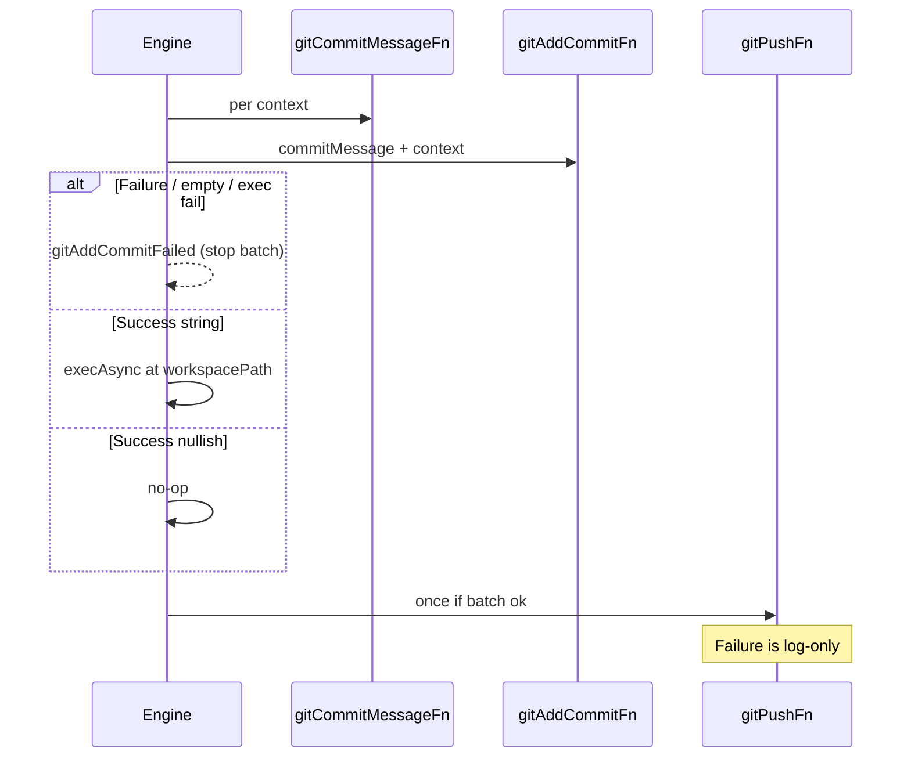

# Requirements: Cleaner core git injectors

| Field | Value |
| --- | --- |
| **Backlog** | `cleaner-core-git-fns` · priority **6** · type **fix** · workflow **[impl]** |
| **Status** | Pending implementation |
| **Depends on** | — |
| **Packages** | Primary: `packages/core`. Also: `packages/apps/cli` (gated git factory, plan envelope, wiring). Recipes / author-facing `LumpJsConfig` unchanged. |

## Problem statement and motivation

Core exposes three separate git command injectors (`gitAddCommandFn`, `gitCommitCommandFn`, `gitPushCommandFn`) that return `MaybePromise<Maybe<string>>`. The CLI already folds add+commit into one locked path and uses nullish returns / throws for control flow. Failure handling is inconsistent (add hard-fails; commit soft-fails; push soft-fails), and injectors cannot return a structured `Failure`.

Concrete pain:

1. Split add/commit does not match real CLI usage (noop add + locked work in commit).
2. Throws and empty-string skips are an awkward error / no-op channel versus `Success` / `Failure` used elsewhere (`refreshRemoteTrackingRefsFn`).
3. Commit soft-fail makes lock/exec errors from gated CLI look like a successful run.
4. `lump-plan` surfaces `gitCommandsByContext` / `gitPushCommand` that are empty or misleading under gated injectors.

## Goals

1. Replace the three legacy `*CommandFn` git injectors with **`gitAddCommitFn`** + **`gitPushFn`** (Result-returning) and keep **`gitCommitMessageFn`** as the sync marker-message producer.
2. Hard-fail the run on add+commit failure with typed `reason: 'gitAddCommitFailed'`; keep push log-only.
3. Clean-break remove `gitAddCommandFn` / `gitCommitCommandFn` / `gitPushCommandFn` (no deprecation shim).
4. Rewire CLI locked git to `makeGatedGitFns` returning the new hooks with `success` / `failure` (no throw).
5. Drop useless git command preview fields from `lump-plan` depth `plan`.
6. Update core defaults, types, tests, and `packages/core/README.md`.

## Non-goals

- Migrating `setupWorkspaceFn` / `teardownWorkspaceFn` to Result or `CommandDescriptor` returns.
- Changing `setContextToFinishedStatus` or other ad-hoc git helpers.
- Unifying command returns as `CommandDescriptor | string` (follow-up backlog: `command-descriptor-or-string-returns`).
- Allowing step `command` / `commandFn` to be a plain shell string (`command-as-shell-string`).
- Author-facing `LumpJsConfig` git fields (still omitted; CLI owns injectors).
- Changing commit-message format, status matching, branch naming, or lock keying.

## User stories / use cases

1. **Core consumer** — Injects `gitAddCommitFn` / `gitPushFn` that either return a shell string for core to run or perform git themselves and return `success(undefined)`.
2. **CLI daemon / run** — Locked add+commit and push run inside `makeGatedGitFns`; failures return `failure(msg)`; add+commit failure fails the lump run with `gitAddCommitFailed`.
3. **Operator (`lump-plan`)** — Plan output no longer includes git add/commit/push command previews.
4. **Maintainer** — Unit tests cover Result outcomes, hard-fail vs push soft-fail, defaults, and CLI gated factory; no legacy `*CommandFn` leftovers.

## Proposed behavior and UX

### Core hooks on `RunLumpInput` / `executeStepsForContextList`

```ts
type GitAddCommitFn = (
  input: Omit<GitAndWorkspaceFnsInput, 'contextList'> & {
    context: Context;
    commitMessage: string;
  },
) => MaybePromise<Success<Maybe<string>> | Failure<string>>;

type GitPushFn = (
  input: GitAndWorkspaceFnsInput,
) => MaybePromise<Success<Maybe<string>> | Failure<string>>;

// unchanged
type GitCommitMessageFn<V extends LumpVariables = LumpVariables> = (
  input: { context: Context; lumpVariables: V; baseBranch: string },
) => string;
```

| Hook | Role |
| --- | --- |
| `gitCommitMessageFn` | Sync subject / status marker; core calls it and passes `commitMessage` into `gitAddCommitFn` |
| `gitAddCommitFn` | Per-context add+commit (once) |
| `gitPushFn` | Once per branch after contexts succeed |

Removed from public API: `gitAddCommandFn`, `gitCommitCommandFn`, `gitPushCommandFn` (types, defaults, `RunLumpInput`, execute-steps params, tests, docs).

### Success / Failure semantics (add+commit and push)

| Return | Core behavior |
| --- | --- |
| `success(string)` | `execAsync` that shell string with `cwd: workspacePath` (opaque shell; not `CommandDescriptor`) |
| `success(null \| undefined)` | No-op (injector already did the work, or intentional skip) |
| `success('')` | Treat as failure (same policy as `Failure` for that hook) |
| `failure(msg)` | Failure policy for that hook |
| throw | Defensive catch; same policy as `Failure` (supported path is returning `Failure`) |

Escaping for returned strings is the injector’s responsibility (defaults use `shellSingleQuote`).

### Engine policy

| Event | Behavior |
| --- | --- |
| `gitAddCommitFn` Failure / `success('')` / throw / returned-command exec fail | Hard fail; skip remaining contexts and push; workspace teardown still runs |
| `gitPushFn` Failure / `success('')` / throw / returned-command exec fail | `logger.error`; run stays success |

Failure data for add+commit:

```ts
type ExecuteStepsFailureReason =
  | 'stepWalkFailed'
  | 'workspaceTeardownFailed'
  | 'gitAddCommitFailed';

// Failure data
{
  reason: 'gitAddCommitFailed';
  message: `Failed to add and commit for context ${context.name}: ${detail}`;
}
```

`detail` is the injector Failure string, thrown `Error.message`, or `execAsync` failure message. Log the same text with `logger.error` before returning. `runLump` may rewrite `message` prefixes but must preserve `reason`.

Per-context order unchanged: walk → `teardownFn` → `gitCommitMessageFn` → `gitAddCommitFn` → (next contexts) → `gitPushFn` → workspace teardown.

### Defaults (`defaultInjectedFns`)

| Hook | Default Success payload |
| --- | --- |
| `defaultGitAddCommitFn` | `git add . && git commit --allow-empty -m <quoted commitMessage>` |
| `defaultGitPushFn` | `git push origin <quoted branchName>` |
| `defaultGitCommitMessageFn` | unchanged (`LUMP:${context.name}`) |

Defaults are async-capable `MaybePromise` (may be `async` or sync `success(...)`).

### CLI gated git

**Owner:** `packages/apps/cli/src/utils/makeGatedGitFns/` (rename from `makeGatedGitCommandFns`; delete old name/export — clean break).

```ts
function makeGatedGitFns(input: {
  gitLock: GitCommonDirLockContext;
}): {
  gitAddCommitFn: GitAddCommitFn;
  gitPushFn: GitPushFn;
}
```

| Hook | Behavior |
| --- | --- |
| `gitAddCommitFn` | Under `withGitCommonDirLock`, run default add then default commit via `execAsync` (one lock hold, two execs); `success(undefined)` or `failure(msg)` |
| `gitPushFn` | Locked default push; `success(undefined)` or `failure(msg)` |

No throws on the supported path. `jsConfigToRunLumpInput` spreads these when `gitLock` is set.

### `lump-plan` envelope

Remove from depth `plan` output:

- `gitCommandsByContext`
- `gitPushCommand`

Do not call git injectors for plan preview. Other plan fields unchanged.

## Technical approach

| Step | Where | Contract / change |
| --- | --- | --- |
| 1 | `packages/core/src/types/` | Add `GitAddCommitFn.ts`, `GitPushFn.ts`; remove `GitAddCommandFn` / `GitCommitCommandFn` / `GitPushCommandFn`; extend `ExecuteStepsFailureReason` with `'gitAddCommitFailed'`; barrel |
| 2 | `defaultInjectedFns.ts` | Defaults for `gitAddCommitFn` / `gitPushFn`; drop legacy defaults |
| 3 | `executeStepsForContextList` | Result-aware runner for the two hooks; hard-fail + reason for add+commit; push soft-fail; empty string = failure |
| 4 | `runLump/main.ts` | Wire new optional fields + defaults; preserve `reason` on failure rewrite |
| 5 | Core unit tests | Retarget stubs/events to new hooks; cover Result matrix and `gitAddCommitFailed` |
| 6 | CLI `makeGatedGitFns` | Rename util; Result returns; wire `jsConfigToRunLumpInput` |
| 7 | `planLumpFromJsConfig` | Drop the two plan git fields + related types/tests |
| 8 | Docs | `packages/core/README.md`; `AGENTS.md` engine/CLI bullets that name the old hooks |

Canonical owners:

- Result-aware git exec helper: only inside `executeStepsForContextList` (replace `runOptionalGitCommand`; no parallel helper in CLI).
- Locked add+commit/push: only `makeGatedGitFns`; callers must not reimplement lock+exec for these hooks.

## Testing strategy

### Unit (core)

| Case | Expect |
| --- | --- |
| Default / stub `gitAddCommitFn` + `gitPushFn` success paths | Existing lifecycle order; one add+commit call per context; one push |
| `gitAddCommitFn` → `failure` / throw / `success('')` / bad shell exec | Hard fail; `reason: 'gitAddCommitFailed'`; no further contexts; no push; teardown still runs |
| `gitPushFn` → `failure` / throw / `success('')` / bad shell exec | Log only; overall success |
| `gitAddCommitFn` → `success(undefined)` | No `execAsync` for that hook |
| `gitCommitMessageFn` | Still sync string; value passed as `commitMessage` |

Update existing suites under `executeStepsForContextList/testing/` and `runLump/unit.test.ts` (legacy field names / soft commit-fail expectations).

### Unit (CLI)

| Case | Expect |
| --- | --- |
| `makeGatedGitFns` | Lock held; add then commit; `success(undefined)` / `failure` (no throw) |
| `jsConfigToRunLumpInput` with `gitLock` | Spreads `gitAddCommitFn` + `gitPushFn` only |
| `planLumpFromJsConfig` depth `plan` | No `gitCommandsByContext` / `gitPushCommand` |

### E2E

No new E2E required for this item.

## Docs updates

| Document | Change |
| --- | --- |
| `packages/core/README.md` | Document `gitAddCommitFn` / `gitPushFn` / unchanged `gitCommitMessageFn`; remove legacy `*CommandFn` sections; fix “where commands run” and flow diagram labels |
| `AGENTS.md` | Engine/CLI bullets: new hook names, Result/`Maybe` semantics, hard-fail reason, gated factory name |
| CLI `DOCS/` | Only if any page documents the removed plan git fields (none found at requirements time; verify during impl) |

## Acceptance criteria

1. `RunLumpInput` / execute-steps expose `gitAddCommitFn`, `gitPushFn`, `gitCommitMessageFn` only (no legacy `*CommandFn` types or fields).
2. Hook Result semantics match the Success/Failure table (nullish no-op; empty string fails; string → `execAsync` at `workspacePath`).
3. Add+commit failures return `reason: 'gitAddCommitFailed'` with the specified message shape; push failures never hard-fail the run.
4. Defaults emit the combined add+commit shell string and the existing push shape.
5. CLI ships `makeGatedGitFns` (old util/export gone) returning Result-based hooks used by `jsConfigToRunLumpInput`.
6. `lump-plan` depth `plan` omits `gitCommandsByContext` and `gitPushCommand`.
7. Core README + `AGENTS.md` match the new API; tests above are green.
8. No second locked add+commit/push implementation outside `makeGatedGitFns`.

## Reference: lifecycle (git slice)


