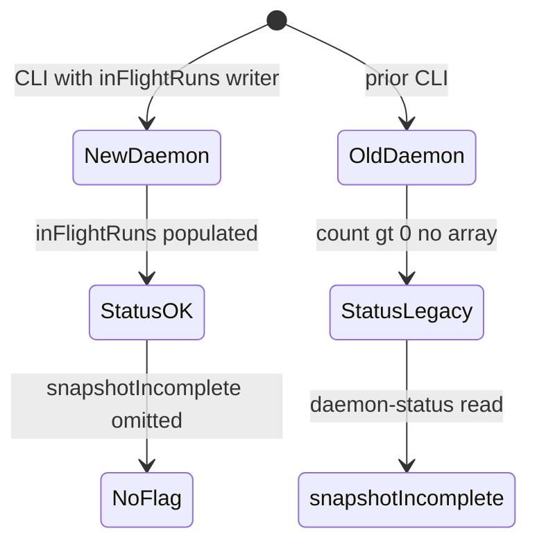

# Requirements: Daemon status snapshot (`daemon-status`)

| Field | Value |
| --- | --- |
| **Backlog** | `daemon-status-snapshot` · priority **2** · type **feature** |
| **Status** | Pending implementation · tickets under `tickets/` (parallel, no `dependsOn`) |
| **Depends on** | — |
| **Packages** | Primary `@lumpcode/cli`. `@lumpcode/core` unchanged. No `@lumpcode/dashboard`, no `@lumpcode/cli-utils` export in this slice. |

## Tickets

Ordered slices via `dependsOn` on each ticket `desc.yml` (sibling names; featureBacklog prefixes `daemon-status-snapshot-` on contexts). Shared contract is this file plus per-ticket `requirements.md` and `blast.yml`.

| Order | Ticket | Blocked by | Delivers | Requirements |
| --- | --- | --- | --- | --- |
| 1 | `daemon-snapshot-meta-schema` | — | `readDaemonMeta` live fields, fingerprint util | `tickets/daemon-snapshot-meta-schema/requirements.md` |
| 2 | `daemon-live-meta-core` | meta-schema | `daemonLiveMeta`, tick + lump lines in `runForeground` | `tickets/daemon-live-meta-core/requirements.md` |
| 3 | `daemon-live-meta-context` | live-meta-core | `contextName` via lump-run hooks | `tickets/daemon-live-meta-context/requirements.md` |
| 4 | `daemon-status-read-snapshot` | live-meta-context | `daemon-status` snapshot read path | `tickets/daemon-status-read-snapshot/requirements.md` |
| 5a | `daemon-status-snapshot-docs` | context, reader | CLI `DOCS/` | `tickets/daemon-status-snapshot-docs/requirements.md` |
| 5b | `daemon-snapshot-meta-deprecation` | context, reader | Drop `inFlightLumpCount` | `tickets/daemon-snapshot-meta-deprecation/requirements.md` |

Docs and deprecation can run in parallel after reader. Campaign is done when all six tickets are completed.

## Problem statement and motivation

Operators and a future worker dashboard need a **one-shot**, file-shaped view of what each background daemon is doing. Today `lumpcode daemon-status` (human and `--json`) exposes PID paths, cron, filters, and only **`inFlightLumpCount`** on meta. That does not say which **lump lines** are active, which **context** is running, or when the **next cron tick** fires. Meta is updated as a scalar count only (`createInFlightMetaUpdater` in `runForeground.ts`).

1. Dashboard work (`worker-dashboard-readonly`) is blocked without a stable JSON contract.
2. Parallel worktree daemons (`maxParallelRun > 1`) can run multiple lumps; a single integer is not enough.
3. Edits to `.lumpcode/local.json` do not apply until daemon restart; operators get no signal from `daemon-status`.

## Goals

1. Extend **`lumpcode daemon-status`** (human + `--json`) with per-daemon **live run detail**, **next tick**, and optional **stale local config** warning.
2. Daemon foreground writers persist that live state in **`.daemon.meta.json`** (same file, serialized writes).
3. Preserve **`stop`** / **`isDaemonMidRun`** behavior during a transition that still writes deprecated **`inFlightLumpCount`** on meta.
4. Document the **`--json`** shape as the contract for `worker-dashboard-readonly` (implemented separately).
5. Ticket **`daemon-snapshot-meta-deprecation`** removes `inFlightLumpCount` from meta writes and public JSON.

## Non-goals

- `lumpcode dashboard`, `@lumpcode/dashboard`, or polling UI (`worker-dashboard-readonly`).
- `daemon-meta-desired-dedup` (split recipe vs live overlay onto `desired.json`).
- Unified `cli-status-dashboard` / merging `lump-status` into one command.
- Published JSON Schema for `daemon-status` output.
- Exporting snapshot types from `@lumpcode/cli-utils` (dashboard ticket may copy documented JSON or add types later).
- Surfacing discovery-only work (`__discovery__`), tick collect/score, or lock holders in `inFlightRuns`.
- `lastTickAt` or diff payloads for stale `local.json`.
- Fabricating placeholder lump rows when meta is legacy (`unknown` names).
- Changing tick concurrency, orchestration, or core engine behavior beyond optional CLI-side telemetry hooks.

## User stories / use cases

1. As an operator — I run `lumpcode daemon-status --json` and see each running daemon’s in-flight lumps, current context names when applicable, and `nextTickAt`, so I know what the worker is doing without tailing logs.
2. As an operator — I run human `daemon-status` and get the same facts in short lines (not a TUI).
3. As an operator — I changed `maxParallelRun` in `local.json` but the daemon is still on the old settings; status shows `localConfigStale: true` and a human note to restart.
4. As a dashboard author — I poll the same JSON envelope later; idle daemons expose `inFlightRuns: []` with predictable keys.
5. As an operator on a mixed fleet — An old daemon still on the previous CLI shows `snapshotIncomplete` when count says work is in flight but per-run rows are missing.

## Proposed behavior and UX

### Command surface

Unchanged usage: `lumpcode daemon-status [options]` (`--daemonId`, deprecated `--lumpName`, `--json`, `--verbose`). List-all mode (no id flags) still returns `{ projectName, daemons[], supervisor }`; each `daemons[]` entry uses the same per-daemon fields as single-daemon mode.

### Types (CLI command module contract)

Defined in `packages/apps/cli/src/commands/daemon-status/main.ts` (names illustrative; fields are normative):

```ts
type DaemonInFlightRun = {
  lumpName: string;
  effectiveDiscoveryBranch?: string;
  contextName?: string;
};

type TickPhase = 'idle' | 'running';

type StatusData = {
  // … existing fields (running, paths, cronSetup, include, exclude, metaStatus, etc.) …

  inFlightRuns: DaemonInFlightRun[];

  nextTickAt?: string;
  tickPhase?: TickPhase;

  localConfigStale?: boolean;

  snapshotIncomplete?: boolean;

  /** @deprecated Prefer inFlightRuns.length. */
  inFlightLumpCount?: number;
};
```

### `StatusData` read rules

| Condition | `inFlightRuns` | `snapshotIncomplete` | `inFlightLumpCount` |
| --- | --- | --- | --- |
| `running: false` or invalid/missing meta | omit or `[]` per existing conventions for stopped daemons | omit | omit |
| `running: true`, valid meta, new writer | array (empty when idle) | omit | deprecated; equals `inFlightRuns.length` on output |
| `running: true`, valid meta, legacy writer (`inFlightLumpCount > 0`, no `inFlightRuns` array) | `[]` | `true` | from meta |
| `running: true`, legacy idle | `[]` | omit | from meta or `0` |

Never synthesize fake `DaemonInFlightRun` rows for legacy meta.

`nextTickAt` and `tickPhase` pass through from meta when present; **do not** compute `nextTickAt` from `cronSetup` alone on read.

### `localConfigStale` (read-time only)

When `running: true` and meta includes **`localConfigFingerprint`**:

1. Resolve live config with **`readProjectLocalConfig`** (same merged `ResolvedProjectLocalConfig` as `start` freezes).
2. Compute fingerprint with the same canonical function used at daemon start (see Technical approach).
3. Set **`localConfigStale: true`** when live fingerprint ≠ meta fingerprint.

When live config cannot be read, or meta has no fingerprint (pre-upgrade daemon), **omit** `localConfigStale` (no false positive).

Human line when `true` (exact wording may vary; must mention restart):

```text
Note: local.json changed since this daemon started; restart the daemon to apply.
```

Human line when `snapshotIncomplete`:

```text
In-flight lump run(s) reported without detail; upgrade/restart the daemon after CLI update.
```

### Human summary for in-flight runs

When `inFlightRuns` is non-empty, human output must name each line (lump + optional branch) and optional context, e.g. `backlog / ctx-a` or `backlog (no context yet)` when `contextName` is omitted inside an active lump line.

### On-disk meta (`DaemonMeta`)

Extend Zod + `DaemonMeta` in `readDaemonMeta/main.ts`:

| Field | Writer | Reader |
| --- | --- | --- |
| `inFlightRuns` | Daemon foreground | `readDaemonMeta`, `daemon-status` |
| `nextTickAt` | Daemon (Croner next run, ISO-8601 UTC) | pass-through |
| `tickPhase` | Daemon | pass-through |
| `localConfigFingerprint` | Once at daemon start | `daemon-status` compare only |
| `inFlightLumpCount` | Transition: keep until follow-up ticket | `isDaemonMidRun`, legacy merge |

**Writer invariant (new daemons):** `inFlightLumpCount === inFlightRuns.length` while both are still written.

**Run identity key:** `(lumpName, effectiveDiscoveryBranch?)` — at most one active entry per pair (engine guarantee). No per-run UUID in v1.

### `inFlightRuns` lifecycle

| Event | Meta change |
| --- | --- |
| Lump line start (`runLumpLine` / equivalent) | Push `{ lumpName, effectiveDiscoveryBranch? }`; increment deprecated count |
| Context walk starts for that line | Set `contextName` on matching entry |
| Context walk ends | Clear `contextName` on that entry |
| Lump line end | Remove entry; decrement deprecated count |

Do not add entries for dedicated discovery scan or tick collect before a lump line starts.

### Tick scheduling fields

- While **`runTick()`** executes: `tickPhase: 'running'`.
- After tick completes and Croner is waiting: `tickPhase: 'idle'`, refresh **`nextTickAt`** from the armed job’s next execution time.
- If cron is not armed or schedule unknown: omit `nextTickAt`.

### Follow-up ticket (end of impl, separate `desc.yml`)

Remove **`inFlightLumpCount`** from meta writes and from `StatusData` JSON; teach **`isDaemonMidRun`** to use `inFlightRuns.length` with read fallback to legacy count/`busy`. Out of scope for the main impl PR except creating the follow-up item.

## Technical approach

1. **`localConfigFingerprint`** — new util `packages/apps/cli/src/utils/localConfigFingerprint/` (barrel-export).  
   `fingerprintResolvedLocalConfig(config: ResolvedProjectLocalConfig) → string` (SHA-256 hex).  
   Input: stable JSON of the full resolved object shape from `resolvedProjectLocalConfigSchema` (all fields after merge, including `projectName`, `mode`, `workspaceStrategy`, `disabled`, `maxParallelRun`, primary branch fields, lump defaults, `refreshCommand`, `verbose`). Canonical serialization: UTF-8 JSON with **sorted object keys** at each object level (document algorithm in util tests).  
   **Owner:** only this util defines the algorithm; `daemon-status` and daemon start must not duplicate hashing.

2. **`daemonLiveMeta`** — new util `packages/apps/cli/src/utils/daemonLiveMeta/` replacing inline `createInFlightMetaUpdater` logic.  
   Serialized async writes to meta path; API sketch:

   - `writeFingerprintAtStart(metaFilePath, baseMeta, fingerprint)`
   - `beginLumpLine({ lumpName, effectiveDiscoveryBranch? })`
   - `setContextName({ lumpName, effectiveDiscoveryBranch?, contextName | null })`
   - `endLumpLine({ lumpName, effectiveDiscoveryBranch? })`
   - `setTickPhase(phase)` / `setNextTickAt(iso)` (may batch with other writes)

   **Owner:** all mutations to `inFlightRuns`, `tickPhase`, `nextTickAt`, and transitional `inFlightLumpCount` on meta. `runForeground.ts` calls this API only; no second meta writer for live fields.

3. **Daemon start** — after `frozenLocalConfig` is known in foreground child, write `localConfigFingerprint` into meta (with existing `baseMeta` / `toMetaWrite` fields).

4. **`runForeground.ts`** — wire Croner lifecycle to `setTickPhase` / `setNextTickAt`; replace `adjust(±1)` with `beginLumpLine` / `endLumpLine` passing `LumpLine` identity.

5. **Context telemetry** — optional CLI-only hooks on the lump run path (e.g. optional callbacks on `runLumpFromJsConfig` input, invoked at context walk start/end in `executeStepsForContextList` wiring or equivalent CLI adapter). **Owner:** hooks live in CLI `runLumpFromJsConfig` / jsConfig adapter; core unchanged unless a minimal optional callback on an existing CLI boundary is required. Daemon `runLumpFromLumpName` passes lump line identity + `daemonLiveMeta` reporter. Manual `lumpcode run` omits hooks.

6. **`readDaemonMeta`** — extend schema; export types for new fields. **`isDaemonMidRun`**: `(inFlightRuns?.length ?? 0) >= 1 || (inFlightLumpCount ?? 0) >= 1 || busy` until follow-up removes count.

7. **`daemon-status/main.ts`** — merge meta into `StatusData` per read rules; compute `localConfigStale`; update human `messages`; mark `inFlightLumpCount` deprecated in TypeScript.

8. **`daemon-snapshot-meta-deprecation`** ticket (see Tickets table).

### Affected files (primary)

| Area | Files |
| --- | --- |
| Meta read/schema | `utils/readDaemonMeta/main.ts` |
| Live meta write | `utils/daemonLiveMeta/`, `utils/launchStartDaemon/runForeground.ts` |
| Fingerprint | `utils/localConfigFingerprint/` |
| Status command | `commands/daemon-status/main.ts` |
| Lump run hooks | `utils/runLumpFromJsConfig/` (or adjacent CLI run adapter) |
| Stop/mid-run | `readDaemonMeta` `isDaemonMidRun`, existing `stop` tests |

## Testing strategy

| Level | What | Where |
| --- | --- | --- |
| Unit | Fingerprint stable across key order; matches for identical `ResolvedProjectLocalConfig` | `localConfigFingerprint/unit.test.ts` |
| Unit | `daemonLiveMeta` begin/set context/clear/end maintains array + deprecated count invariant | `daemonLiveMeta/unit.test.ts` |
| Unit | `readDaemonMeta` parses new fields; `isDaemonMidRun` legacy + new paths | extend `readDaemonMeta/unit.test.ts` |
| Unit | `daemon-status` JSON: `inFlightRuns` always when running; `snapshotIncomplete` legacy; `localConfigStale`; deprecated count | extend `commands/daemon-status/unit.test.ts` |
| Unit | Foreground meta keys still allowed set (no stray child pids); parallel peaks | extend `daemonInFlightMeta.unit.test.ts`, `parallelGlobalDaemon.unit.test.ts` |
| Unit | `stop` still refuses mid-run with legacy meta and with `inFlightRuns` only (after writer change) | `stop/unit.test.ts` |
| Integration / start testing | Tick writes `nextTickAt` / `tickPhase`; lump line pushes/removes rows | `start/testing/` (foreground harness) |
| E2E | Optional: `daemon-status --json` sees `inFlightRuns` during mocked slow lump | extend `daemon-scenarios` or harness if low cost |

Update existing `inFlightLumpCount`-only daemon-status tests to assert `inFlightRuns` alongside deprecated count.

## Docs updates

| Document | Change |
| --- | --- |
| `packages/apps/cli/DOCS/commands.md` | `daemon-status` JSON fields: `inFlightRuns`, `nextTickAt`, `tickPhase`, `localConfigStale`, `snapshotIncomplete`; deprecate `inFlightLumpCount` on output |
| `packages/apps/cli/DOCS/concepts.md` | Daemon meta table: live overlay fields on `.daemon.meta.json` |
| `AGENTS.md` | Only if impl touches agent memory facts (meta writer, status contract); optional in same PR |

## Acceptance criteria

1. Running daemon with valid meta: `lumpcode daemon-status --json` includes **`inFlightRuns`** (array, possibly empty) and does not omit the key when `running: true`.
2. During a lump run with at least one context started, JSON includes **`contextName`** on the matching entry; between contexts on the same line, **`contextName` is absent** on that entry.
3. Parallel worktree run (`maxParallelRun: 2`): meta and status show **two entries** with distinct `(lumpName, effectiveDiscoveryBranch?)` when two lines run.
4. Meta on disk contains **`inFlightRuns`** maintained by the daemon; **`inFlightLumpCount` matches array length** while both are written.
5. **`nextTickAt`** and **`tickPhase`** update across tick boundaries (tests or manual checklist documented in PR).
6. **`localConfigFingerprint`** written at start; after editing `local.json`, **`localConfigStale: true`** on status without daemon restart.
7. Legacy meta (count only, no array): **`snapshotIncomplete: true`**, **`inFlightRuns: []`**, no fake lump names.
8. **`isDaemonMidRun` / `stop` default refuse** still work for mid-run meta (legacy and new shape).
9. No second meta live writer outside **`daemonLiveMeta`**; no duplicate fingerprint logic outside **`localConfigFingerprint`**.
10. **`daemon-snapshot-meta-deprecation`** completed (no `inFlightLumpCount` on meta or status JSON).
11. **`daemon-status-snapshot-docs`** completed.

## Reference: legacy bridge


