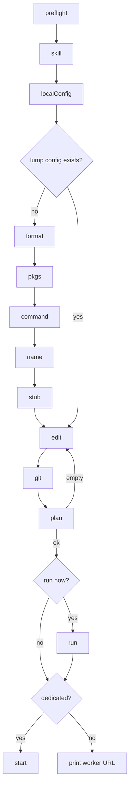

# Requirements: Interactive `lumpcode setup`

| Field | Value |
| --- | --- |
| **Backlog** | `lumpcode-setup` · priority **1** · workflow **[manualReq, testImpl, impl]** |
| **Type** | feature |
| **Status** | Pending implementation |
| **Depends on** | — |
| **Packages** | Primary: `packages/apps/cli` (new `setup` command, scaffold util, template expander, `project-setup` thin wrap, `main.ts` wiring, DOCS). Also: `packages/apps/website` (First PR, worker, commands). `@lumpcode/core` (consume `getCodeBasePaths` only; no API change), `cli-types`, `cli-utils`, `recipes` unchanged. |

## Problem statement and motivation

`lumpcode project-setup` is a flag-only scaffold. First PR is a multi-command tutorial (`project-setup`, `lump-create`, edit, `lump-plan`, `run`). Operators bounce between docs and the shell. Dedicated worker setup is a different page that must not re-run `project-setup`.

Pain:

1. No single command that drives the First PR path.
2. `project-setup` cannot resume on a clone that already has `.lumpcode/`.
3. The `lump-create` stub (`baseBranch: "main"`, `command: "claude"`, `src/{NAME}.ts`) often yields an empty plan.
4. JSON `contextListJson` with a literal path (docs smoke `README.md`) does not match today (no `{placeholder}`).

## Goals

1. **`lumpcode setup`** — interactive TTY drive: machine checks, optional skill, project + local config, first lump, optional commit/push, `lump-plan` then `run`, optional dedicated `start`.
2. **Keep `project-setup`** — unchanged flag-only create (still refuses if `.lumpcode/` exists). Share write helpers; do not alias it to `setup`.
3. **Resume-from-hole** — if `.lumpcode/` exists, skip completed writes; still ask this machine’s `local.json` mode/strategy.
4. **Exact-path templates** — no-placeholder `contextListJson` values match that relative path exactly.
5. **Docs** — First PR / `get-started.md` happy path is `lumpcode setup`.

## Non-goals

- Opening a PR (`gh`, `openPrPostTeardown`).
- Scaffolding a custom command module (wait until `getCommandPath` resolves).
- Glob `*` / `{FILE}` / `{FILE}.js` in JSON `contextListJson`.
- `--yes` or other prompt-skip flags (that is `project-setup`).
- Changing `project-setup` flag defaults (`primaryBranch` still defaults to `main` when the flag is omitted).
- Deprecating `project-setup` or `lump-create`.
- Importing other command `main` modules from `setup`.
- Writing `@lumpcode/cli-utils` / `@lumpcode/recipes` into `package.json` on JSON format.
- Documenting `supervise` as an operator command.

## User stories / use cases

1. **New laptop** — Runs `lumpcode setup` in a git repo, follows prompts (shared, checkout, JSON, README lump), accepts CLI commit+push, confirms run, opens the printed branch as a PR.
2. **JS/TS author** — Picks `ts`, accepts `npm install @lumpcode/cli-utils @lumpcode/recipes`, gets a `contextMatchFn` stub over `*.js` (or a chosen suffix).
3. **Custom agent** — No preset on `PATH`. After `.lumpcode/commands/` exists, pastes a tag until `getCommandPath` hits (project or `~/.lumpcode/commands/`).
4. **Worker clone** — `.lumpcode/` already on git. `setup` writes `local.json` (dedicated + wipe confirm), skips lump create, offers `run` then unfiltered `start`.
5. **Script** — CI calls `project-setup --mode shared`. `setup` without a TTY (or with `--json`) fails and points at `project-setup`.

## Proposed behavior and UX

### CLI

```text
lumpcode setup [--projectPath <dir>]
```

| Gate | Failure |
| --- | --- |
| `stdin` is not a TTY | Use `project-setup` for non-interactive init |
| Global `--json` | `setup` is interactive |
| `--projectPath` | Resolve that dir, then `git rev-parse --show-toplevel` as `projectRoot` |

No `--mode`, `--primaryBranch`, `--yes`, `--lumpName`. Other prompts only.

`project-setup` stays registered and documented.

### Command module

`packages/apps/cli/src/commands/setup/` (`main.ts`, `index.ts`, tests). Register as `setup` from `commands/index.ts` and `main.ts` injections (same pattern as `projectSetup`).

```ts
// inputSchema: baseCommandOptions + optional projectPath
type Output = {
  messages: string[];
  data?: {
    projectRoot: string;
    lumpName?: string;
    branchName?: string;
    startedDaemon?: boolean;
  };
};

type SetupPrompter = {
  confirm(input: { message: string; defaultValue: boolean }): Promise<boolean>;
  select(input: { message: string; choices: { value: string; label: string }[] }): Promise<string>;
  input(input: { message: string; defaultValue?: string }): Promise<string>;
  pause(input: { message: string }): Promise<void>;
};

type Injections = {
  isInteractive?: boolean;   // default: process.stdin.isTTY === true
  prompter?: SetupPrompter;  // default: terminal prompts
};
```

`setup` must not import `commands/*/main`. Orchestrate through the owners in Technical approach.

### Step spine

| Id | When | Behavior |
| --- | --- | --- |
| `preflight` | always | See table below. Hard-fail. |
| `installSkill` | always | Confirm, **default yes**. Yes → `npx skills add lumpcode/skills` at `projectRoot`. Failure → warn, continue. |
| `localConfig` | always | Confirm/write `project.json` + `local.json` (resume rules below). Then custom-command wait can see `.lumpcode/commands/`. |
| `configFormat` | no lump config yet | `json` \| `js` \| `ts` |
| `installAuthoringPkgs` | format is `js` or `ts` | Confirm, **default yes**. Yes → `npm install @lumpcode/cli-utils @lumpcode/recipes` at `projectRoot` (`dependencies`, registry). No `package.json` → write `{ "name": "<projectName>", "private": true }` first. Failure → warn, continue. |
| `chooseCommand` | no lump config yet | See command choice. |
| `lumpName` | no lump config yet | Default `myFirstLump`. `assertValidLumpName`. If that lump already has a config, ask another name. |
| write stub | no lump config yet | See stubs. |
| `editLump` | always after a lump path exists | Print config path. `pause` (Enter). No `$EDITOR`. No plan here. |
| `commitPush` | always | `cli` (default) or `manual`. |
| `run` | always | Plan → confirm → `runLumpFromLumpName`. |
| `start` | `mode === 'dedicated'` only | Confirm, default yes. Unfiltered `global`. Shared: skip; print worker URL. |

### `preflight`

| Check | Probe |
| --- | --- |
| Git work tree | `git rev-parse --show-toplevel` (project root). Not a work tree → fail (same idea as `project-setup`). |
| `origin` | `git remote get-url origin` |
| Origin reachable | `git ls-remote --heads origin` |
| Identity | non-empty `git config user.name` and `user.email` |
| Agents | which of `cursor-agent`, `copilot`, `claude`, `opencode`, `codex` are on `PATH` (tags `cursor`, `copilot`, `claude-code`, `opencode`, `codex`) |

Do not probe push. Do not require a preset binary (empty list is OK). Do not check `primaryBranch` until it is chosen.

### `localConfig` writes

**Fresh** (no `.lumpcode/`):

| File | Fields |
| --- | --- |
| `project.json` | `projectName` (infer via existing `sanitizeInferredProjectName` / origin-or-basename; confirm). `primaryBranch` (infer `origin/HEAD` then current branch, not hardcoded `main`; confirm). Then `ls-remote` must list that branch. |
| `local.json` | `mode` (default `shared`). `workspaceStrategy` (default `checkout`). Dedicated → extra confirm that `run` resets **this** checkout. `maxParallelRun` only if `worktree`; omit key when `1`. |
| gitignore | Same lines as today’s `project-setup`. |
| dirs | `lumps/`, `commands/` |

Do not write `command`, `keepHistory`, `verbose`, `refreshCommand`, `disabled`, or `primaryBranches` in this wizard.

**Resume** (`.lumpcode/` exists):

| Present | Action |
| --- | --- |
| Valid `project.json` `projectName` | Do not rewrite `project.json`. |
| `local.json` | Still ask mode/strategy/(maxParallelRun). Merge those keys onto the existing file; keep other keys. |
| Lump config already on disk | Skip `configFormat`, `installAuthoringPkgs`, `chooseCommand`, `lumpName`, stub write. Still `editLump`. |
| Nothing new to commit | Still offer `commitPush` (push may still be needed). |

`project-setup` on an existing `.lumpcode/` still fails (unchanged).

### Command choice (`chooseCommand`)

| `agentsOnPath` | Prompt |
| --- | --- |
| `[]` | Print `https://www.lumpcode.com/docs/author/agents`. Ask for a tag. Retry on Enter until `getCommandPath(tag)` returns a file (project `.lumpcode/commands/<tag>.ts\|.js` or global). |
| one preset | Confirm that tag; offer custom (same wait). |
| several | Select one; same custom escape. |

Chosen tag is the first lump’s `prompt.command`. Not written on `project.json`.

### Stubs

Prompt on every stub: `clean and improve the code in @{FILE}`. No `baseBranch`. No `defineConfig` / recipe imports.

**JSON**

```ts
contextListJson: { FILE: string }  // exact relative path
prompt: { promptTemplate: 'clean and improve the code in @{FILE}'; command: string }
```

Default path `README.md` if that file exists at repo root. Else ask for one existing file (default: first `getCodeBasePaths` file whose exact-path context name is legal).

Exact-path context name (expander + setup validation): basename with the final `.[^/.]+` stripped. Must match `^[a-zA-Z0-9_-]+$` (`validateContextListNames`). Refuse the file if not.

**js / ts** — `export default { contextMatchFn, prompt }`.

| `contextMatchFn` | Rule |
| --- | --- |
| skip | `codeBasePath.isDir` |
| skip | path does not end with suffix (default `.js`) |
| return | `{ contextName, filePathVariableName: 'FILE' }` |

If no scanned file has suffix `.js`, ask for another suffix (e.g. `.ts`) before writing.

```ts
function contextNameFromPath(filePath: string): string
// strip final extension, then replace each run of chars outside [a-zA-Z0-9_-] with '-'
```

This sanitizer lives **in the generated lump file**, not as a published CLI util. It is not the exact-path expander rule.

### Exact-path expander

Owner: `makeGetContextListFnFromTemplate` only.

When a template value has **no** `{placeholder}` / `$modifier{…}`: if the normalized scanned path equals the normalized template, emit one context: `variables[key] = path`, `name` = exact-path context name above. No match → no context (same as today for leftover files).

### `commitPush`

| Choice | Behavior |
| --- | --- |
| `cli` (default) | `git add` only the list below. Commit subject `Add Lumpcode setup and <lumpName>` (not a `LUMP:` marker). `git push -u origin HEAD`. |
| `manual` | Print the same commands. `pause`. Do not verify they pushed. |

Add only if the path exists: `.gitignore`, `.lumpcode/project.json`, `.lumpcode/lumps/`, `.lumpcode/commands/`, `package.json`, `package-lock.json`. Never `local.json` or `node_modules/`. Never the rest of a dirty tree.

No-op commit (already committed) → still push. Add/commit/push failure → stop the drive (no `run`).

### `run`

1. `planLumpFromJsConfig` depth `contexts`. Empty list → message, `editLump` again, do not run.
2. Print context names. Confirm run (agent / LLM cost), default yes. No → skip to `start` if dedicated, else done.
3. `installRunAbortHandlers` + `runLumpFromLumpName` (same locks, shared copy vs dedicated reset).
4. Success → print `lump/<lumpName>/…` and “open this as a PR on your git remote.” Set `data.branchName`. No `gh`.
5. Failure → stop. No `start`.

### `start` (dedicated only)

Confirm “leave a worker running?”, default yes. Yes → `launchStartDaemon` unfiltered `daemonId: 'global'`, default cron, detached (not `--foreground`). Print `daemon-status` / `daemon-log` / `stop`. `data.startedDaemon: true`. Shared: do not call `start`; print `https://www.lumpcode.com/docs/start/worker`.

## Technical approach

| Step | Where | Contract |
| --- | --- | --- |
| 1 | `utils/getProjectName/` | Lift `project-setup`’s infer-or-flag name resolution here (`resolveInferredProjectName` or equivalent). `project-setup` and `setup` call it. |
| 2 | `utils/scaffoldLumpcodeProject/` | **Create-only** owner: mkdir `.lumpcode/{lumps,commands}`, write caller-supplied `project.json` + `local.json`, `appendMissingGitignoreLines` (same line set as today). Fail if `.lumpcode/` exists. `project-setup` passes `{ mode }` only. Fresh `setup` passes mode + optional strategy / `maxParallelRun`. |
| 3 | `commands/project-setup/` | Thin wrap: flags → infer name / defaults → `scaffoldLumpcodeProject`. Still refuse when `.lumpcode/` exists. |
| 4 | `makeGetContextListFnFromTemplate` | Exact-path rule (only owner). |
| 5 | `commands/setup/` | Drive + default prompter. Resume merge for `local.json`. Stub writers. `commitPush` git. Calls `getCommandPath`, `getCodeBasePaths`, `planLumpFromJsConfig`, `installRunAbortHandlers`, `runLumpFromLumpName`, `launchStartDaemon`. |
| 6 | `commands/index.ts`, `main.ts` | Export + injections (`isInteractive` / `prompter` optional). |
| 7 | DOCS + website | See Docs updates. Missing-file hints in `readLocalConfig` / `readProjectJson` may mention `setup` **or** `project-setup`. |

Canonical owners (do not reimplement elsewhere):

| Concern | Owner |
| --- | --- |
| Fresh `.lumpcode/` files + gitignore | `scaffoldLumpcodeProject` |
| Project name infer | `getProjectName` |
| Exact-path `contextListJson` | `makeGetContextListFnFromTemplate` |
| Command tag resolve | `getCommandPath` |
| Plan / run / start | `planLumpFromJsConfig` / `runLumpFromLumpName` / `launchStartDaemon` |
| Drive prompts + resume + stubs + setup git | `commands/setup` |

## Testing strategy

Workflow is `testImpl` then `impl`: add cases (skip until impl if that is the stage). Prefer extending existing suites over new files when a host already exists.

### Unit

| Area | Host | Expect |
| --- | --- | --- |
| Drive gates | `commands/setup/` (colocate `testing/` if the suite is large) | No TTY / `--json` fail. Injected `prompter` walks happy path (shared + JSON + README + cli push + run). Dedicated wipe confirm. Custom tag retries until `getCommandPath` hits. Skill / npm failure warns and continues. Empty plan returns to `editLump`. Shared never calls `launchStartDaemon`. |
| Resume | same | Existing `project.json` not rewritten. `local.json` merge keeps extra keys. Existing lump skips stub write. |
| `commitPush` | same | Add-list only; no `local.json`. |
| Scaffold | `scaffoldLumpcodeProject/` + existing `project-setup/unit.test.ts` | Create writes; second create fails. `project-setup` still mode-only `local.json` + `primaryBranch` on project. |
| Exact-path | `makeGetContextListFnFromTemplate/unit.test.ts` | `README.md` → context `README`. Nested legal basename. Invalid derived name does not emit a usable context (or fails validation at plan). `{NAME}.md` unchanged. |

Do not inject TTY into other commands. Mock `execAsync` / `execBinary` / git; do not inject a second exec wrapper unless setup cannot mock those APIs.

### E2E

No full interactive drive required. Optional thin case: JSON exact-path `README.md` is visible to `lump-plan --contexts` (existing e2e harness + mock agent). Do not require a live agent for `setup` itself.

## Docs updates

| Document | Change |
| --- | --- |
| `packages/apps/website/app/pages/docs/start/first-pr.vue` | Happy path is `lumpcode setup`. Keep skill as something the drive offers (optional). Link worker after. |
| `packages/apps/cli/DOCS/get-started.md` | Same: one-command drive; `project-setup` as flags-only. |
| `packages/apps/website/app/pages/docs/start/worker.vue` | May run `setup` to write `local.json` / offer `start`. Still do **not** run `project-setup`. |
| `packages/apps/cli/DOCS/commands.md` + website `/docs/reference/commands` | New `lumpcode setup` (options, TTY, resume). Keep `project-setup`. |
| `packages/apps/cli/DOCS/lump-config.md` | Exact-path `contextListJson` (no placeholder = exact relative path). |
| `AGENTS.md` | One bullet: `setup` is the interactive First PR drive; `project-setup` remains flag-only. |

## Acceptance criteria

1. `lumpcode setup --projectPath` is registered; TTY and `--json` gates fail as specified.
2. Fresh drive writes `project.json` / `local.json` / gitignore / first lump stub per format; `project-setup` still refuses an existing tree and still writes mode-only `local.json` when used alone.
3. Resume does not rewrite `project.json`; still prompts mode/strategy; skips stub when a lump config exists.
4. JSON README (or asked file) plans to exactly one legal context after the expander change. js/ts stub matches suffix files with sanitized names.
5. `chooseCommand` never silently picks the first of several PATH presets; custom waits on `getCommandPath`.
6. `commitPush` `cli` adds only the allowlist and pushes `HEAD`; failure blocks `run`.
7. `run` uses `runLumpFromLumpName` (not `commands/run/main`); empty plan does not run; success prints the branch and does not open a PR.
8. Dedicated opt-in `start` uses unfiltered `global` via `launchStartDaemon`; shared never starts a daemon.
9. Skill default yes and authoring-pkg default yes (js/ts only); those install failures do not abort the drive.
10. First PR / get-started / commands / worker / exact-path docs match. No second scaffold implementation outside `scaffoldLumpcodeProject`. No second exact-path matcher outside `makeGetContextListFnFromTemplate`.

## Reference: drive


