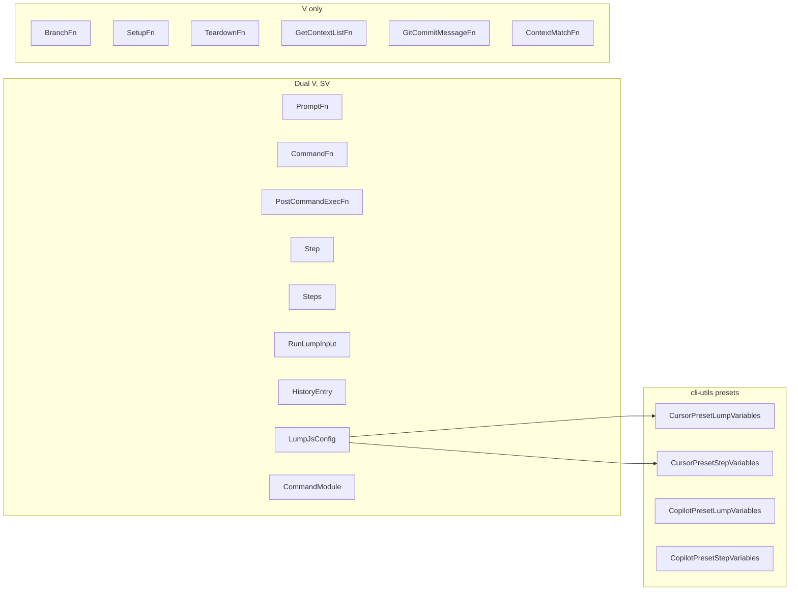

# Requirements: Typed lump/step variables and preset contracts


| Field          | Value                                                                                                                                                                                                                         |
| -------------- | ----------------------------------------------------------------------------------------------------------------------------------------------------------------------------------------------------------------------------- |
| **Backlog**    | `typed-lump-and-step-variables` · priority **2** · type **feature**                                                                                                                                                           |
| **Status**     | Pending implementation                                                                                                                                                                                                        |
| **Depends on** | —                                                                                                                                                                                                                             |
| **Packages**   | Primary: `@lumpcode/core`, `@lumpcode/cli-utils`, `@lumpcode/cli` (authoring types + DOCS). Soft-align: `@lumpcode/cli-types`. Unchanged: `@lumpcode/recipes`, shipped preset `.js` runtime behavior, `lumpcode` meta package |


## Problem statement and motivation

`lumpVariables` and `stepVariables` are untyped `Record<string, unknown>` end-to-end. Shipped presets (`cursor`, `copilot`) read well-known keys (`model`, `agentPermissions`, step-only session keys) with no exported TypeScript contract, so consumers cannot get compile-time checking when authoring lump configs against those presets.

1. `defineConfig<V>` only refines `lumpVariables`; `stepVariables` on steps stay loose.
2. Core hooks (`PromptFn`, `CommandFn`, …) do not propagate refined variable types into callbacks.
3. Preset option shapes live only in prose (`advanced-config.md`) and untyped JS reads, not in a publishable type surface.
4. `@lumpcode/cli-types` is being deprecated in favor of `@lumpcode/cli-utils`, so new consumer-facing types must land on `cli-utils`.


## Goals

1. Thread independent generics `V` (lump) and `SV` (step) through core and CLI authoring types, with defaults equal to today’s `LumpVariables` / `StepVariables` so existing untyped code keeps compiling.
2. Make all variable-carrying `define*` helpers (including command-module helpers) generic so refined `V`/`SV` are not erased at the helper boundary.
3. Export closed, extendable (`& Extra`) TypeScript contracts for what `cursor` and `copilot` presets read from `lumpVariables` / `stepVariables`, from `@lumpcode/cli-utils`.
4. Document the consumer import path, `defineConfig<V, SV>` usage, preset type names, and `& Extra` extendability in `cli-utils` README and CLI DOCS.


## Non-goals

- New agent presets (`claude-code`, `opencode`, `codex`) or changes to shipped preset `.js` install/runtime behavior.
- Zod schemas or runtime validation/rejection of variable shapes inside presets or config load.
- Hard deletion or stop-depending on `@lumpcode/cli-types` (soft signature alignment only).
- Migrating in-repo `.lumpcode/lumps/**` configs to use the new generics.
- Nesting preset options under a new namespace (e.g. `preset: { … }`); breaking reshape of existing `model` / `agentPermissions` keys.
- Open index signatures on preset contracts (`[key: string]: unknown`).
- Constraining `SV extends V` or collapsing to a single variables generic.
- Changing prompt template substitution (still `context.variables`, not `lumpVariables`).


## User stories / use cases

1. As a lump author — I parameterize `defineConfig` with preset lump/step types, so invalid preset keys are caught at compile time.
2. As a lump author — I intersect preset types with my own keys (`& { myFlag: boolean }`), so I can pass custom hook data while still typing preset options.
3. As a hook/command-module author — I use `definePromptFn` / `defineCommand` / `defineCommandModule` with the same `V`/`SV`, so callbacks see refined `lumpVariables` / `stepVariables`.
4. As a library consumer — I import types and `define*` from `@lumpcode/cli-utils` only, so I do not depend on deprecated `cli-types` for new work.


## Proposed behavior and UX


### Bounds (unchanged)


| Type            | Definition                |
| --------------- | ------------------------- |
| `LumpVariables` | `Record<string, unknown>` |
| `StepVariables` | `Record<string, unknown>` |


`V extends LumpVariables` and `SV extends StepVariables` are **independent** (no `SV extends V`).

### Core generic split


| Surface                                                                                                                             | Type params | Notes                                      |
| ----------------------------------------------------------------------------------------------------------------------------------- | ----------- | ------------------------------------------ |
| `PromptFn` / `PromptFnInput`, `CommandFn`, `PostCommandExecFn`                                                                      | `<V, SV>`   | Both bags on the input                     |
| `Step`, `Steps`, `RunLumpInput`, `runLump`                                                                                          | `<V, SV>`   | `steps: Steps<V, SV>`; `lumpVariables?: V` |
| `HistoryEntry`                                                                                                                      | `<V, SV>`   | Both bags present on the entry             |
| `BranchFn`, `SetupFn`, `TeardownFn`, `GetContextListFn` / `GetContextListFnInput`, `GitCommitMessageFn` / `GitCommitMessageFnInput` | `<V>`       | Lump bag only                              |
| Git add/commit/push command fn types                                                                                                | none        | No variable bags today                     |


Defaults on every new type parameter remain the current unbound bags so call sites without explicit params behave as today.

### CLI authoring types


| Type                                                    | Type params                                                                                        |
| ------------------------------------------------------- | -------------------------------------------------------------------------------------------------- |
| `LumpJsConfig`, `LumpJsConfigStep`, `LumpJsConfigSteps` | `<V, SV>`                                                                                          |
| `LumpJsonConfig`, `LumpJsonConfigStep`                  | `<V, SV>` (`stepVariables?: SV` on JSON steps; function fields still excluded from JSON config)    |
| `CommandModule`                                         | `<V, SV>` — `command: CommandFn<V, SV>`; `setup?` / `teardown?` use `SetupFn<V>` / `TeardownFn<V>` |
| `ContextMatchFn`                                        | `<V>` — `lumpVariables: V` (replace hardcoded `Record<string, unknown>`)                           |


### `define*` helpers

Consumer home: `@lumpcode/cli-utils`. Soft-align `@lumpcode/cli-types` to the **same** signatures (re-export path keeps working until a later deprecation PR).


| Helper                                                                                                                                                                             | Generics                       |
| ---------------------------------------------------------------------------------------------------------------------------------------------------------------------------------- | ------------------------------ |
| `defineConfig`, `defineStep`                                                                                                                                                       | `<V, SV>`                      |
| `definePromptFn`, `defineCommand`, `definePostCommandExecFn`                                                                                                                       | `<V, SV>`                      |
| `defineCommandModule`                                                                                                                                                              | `<V, SV>`                      |
| `defineCommandSetup`, `defineCommandTeardown`, `defineSetupFn`, `defineTeardownFn`, `defineBranchFn`, `defineGetContextListFn`, `defineGitCommitMessageFn`, `defineContextMatchFn` | `<V>`                          |
| Helpers for types with no variable bags (e.g. git add/commit/push, `defineContextOptionsFn`)                                                                                       | unchanged (no new type params) |


Signature shape (pattern for all generic helpers):

`defineConfig<V extends LumpVariables = LumpVariables, SV extends StepVariables = StepVariables>(config: LumpJsConfig<V, SV>) → LumpJsConfig<V, SV>`

### Preset contracts (`@lumpcode/cli-utils`)

**Source directory:** `packages/apps/cli/cli-utils/src/presets/` (barrel-exported from the package root).

**Types only** (no Zod, no runtime checks in preset `.js`).


| Export                       | Shape                                                            |
| ---------------------------- | ---------------------------------------------------------------- |
| `PresetSessionStepVariables` | `{ newChat?: boolean; chatIdIndex?: string | null }`             |
| `CursorAgentPermissions`     | `{ cursorConfigDir?: string }`                                   |
| `CopilotAgentPermissions`    | `{ writablePaths?: string[]; denyShell?: string[] }`             |
| `CursorPresetLumpVariables`  | `{ model?: string; agentPermissions?: CursorAgentPermissions }`  |
| `CopilotPresetLumpVariables` | `{ model?: string; agentPermissions?: CopilotAgentPermissions }` |
| `CursorPresetStepVariables`  | `CursorPresetLumpVariables & PresetSessionStepVariables`         |
| `CopilotPresetStepVariables` | `CopilotPresetLumpVariables & PresetSessionStepVariables`        |


- Closed known keys (no index signature).
- `model` and `agentPermissions` on **both** lump and step contracts; session keys step-only.
- Extendability: consumer intersects, e.g. `CursorPresetLumpVariables & { myHookFlag: boolean }` (no dedicated `Extend*` helper).
- Mirrors keys the shipped `cursor` / `copilot` presets already read; does not invent new runtime options.


### Consumer usage (documented)

```ts
import {
  defineConfig,
  type CursorPresetLumpVariables,
  type CursorPresetStepVariables,
} from '@lumpcode/cli-utils';

export default defineConfig<
  CursorPresetLumpVariables & { myHookFlag: boolean },
  CursorPresetStepVariables & { myHookFlag: boolean }
>({ /* … */ });
```


## Technical approach


| Step | Package / area                     | Contract change                                                                                                                         |
| ---- | ---------------------------------- | --------------------------------------------------------------------------------------------------------------------------------------- |
| 1    | `@lumpcode/core` types + `runLump` | Add `<V>` / `<V, SV>` per tables above; keep default type args                                                                          |
| 2    | `@lumpcode/cli` `src/types/*`      | Parameterize `LumpJsConfig*`, `LumpJsonConfig*`, `CommandModule`, `ContextMatchFn`                                                      |
| 3    | `@lumpcode/cli-types` helpers      | Same generic `define*` signatures as `cli-utils` (soft align)                                                                           |
| 4    | `@lumpcode/cli-utils`              | Own/export 2-generic `defineConfig` and other generic `define*` as the consumer home; add `src/presets/*` contracts; root barrel export |
| 5    | Docs                               | Update surfaces listed in Docs updates                                                                                                  |
| 6    | Compile / tests                    | Fix fallout from signature changes; add type-level coverage for generics + preset contracts                                             |


No runtime behavior change required for engine execution or preset command modules beyond TypeScript typing.

## Testing strategy


| Level                 | What to prove                                                                                                                                                                                                                                                               |
| --------------------- | --------------------------------------------------------------------------------------------------------------------------------------------------------------------------------------------------------------------------------------------------------------------------- |
| **Unit (type-level)** | Dedicated compile fixtures (or equivalent) under core and/or `cli-utils`: refined `V`/`SV` flow into `PromptFn`/`CommandFn`/`defineConfig`/`defineCommandModule`; excess/invalid preset keys error; `& Extra` accepted; default type params keep untyped configs assignable |
| **Unit (existing)**   | Update any tests that assert or construct typed configs/helpers if signatures break compilation                                                                                                                                                                             |
| **Integration / E2E** | Not required for this types-only change; no new runtime paths                                                                                                                                                                                                               |


Existing tests that import `defineConfig` / core types must still typecheck with defaults after the change.

## Docs updates


| Document                                    | Change                                                                                                                                                          |
| ------------------------------------------- | --------------------------------------------------------------------------------------------------------------------------------------------------------------- |
| `packages/apps/cli/cli-utils/README.md`     | Import `defineConfig` + preset variable types from `@lumpcode/cli-utils`; show `<V, SV>` and `& Extra` example                                                  |
| `packages/apps/cli/DOCS/types.md`           | Document dual generics on `LumpVariables`/`StepVariables` consumers (`LumpJsConfig`, hooks, `CommandModule`, `ContextMatchFn`); list preset contract type names |
| `packages/apps/cli/DOCS/advanced-config.md` | In preset options / agent permissions sections, point to the exported type names and authoring pattern                                                          |
| `packages/apps/cli/cli-types/README.md`     | Note 2-generic `define*` alignment and that new work should prefer `@lumpcode/cli-utils`                                                                        |


## Acceptance criteria

1. `runLump` / `RunLumpInput` / `Step` / `Steps` and both-bag hooks accept `<V, SV>` with defaults preserving today’s assignability.
2. Lump-only hooks listed above accept `<V>` with the same default behavior.
3. `LumpJsConfig`, `LumpJsonConfig`, `CommandModule`, and `ContextMatchFn` expose the agreed generics.
4. All variable-carrying `define*` helpers (including `defineCommandModule` / setup / teardown) are generic and do not erase `V`/`SV`.
5. Preset contracts listed above are exported from `@lumpcode/cli-utils` (source under `cli-utils/src/presets/`).
6. `@lumpcode/cli-types` exposes matching `define*` / config type signatures (soft align); package is not removed.
7. Docs in the Docs updates table describe the consumer path, type names, and `& Extra` extendability.
8. `npm run build` / tests for `core`, `cli-types`, `cli-utils`, and `cli` pass; no intentional runtime behavior change to preset `.js` modules.
9. New agent presets, Zod/runtime validation, hard `cli-types` cutover, and in-repo lump migrations are absent from the change.


## Reference: generic coverage map




