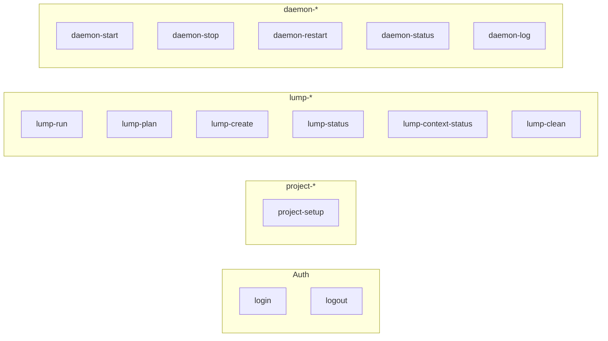

# PRD: Clean command family naming

| Field | Value |
| --- | --- |
| **Backlog** | `clean-command-family-naming` · priority **1** |
| **Depends on** | — |
| **Blocks** | `duplicate-arguments-as-options` (argument/option mirroring must target **canonical** command names) |
| **Packages** | `packages/apps/cli` (primary); `packages/core` unchanged; user-facing docs under `packages/apps/cli/DOCS/` and `packages/apps/cli/README.md` |

## Problem statement and motivation

The Lumpcode CLI exposes **16 subcommands** today with **inconsistent prefixes**. Some operations already use a family prefix (`lump-create`, `lump-status`, `lump-plan`, `project-setup`, `daemon-status`, `daemon-log`), while the highest-traffic commands use **short, unprefixed names** (`run`, `start`, `stop`, `restart`, `clean`) and one lump-scoped command uses a different pattern (`context-status`).

That inconsistency hurts discoverability and documentation:

1. **`lumpcode --help`** lists commands alphabetically with no grouping; users cannot tell which commands belong to “run a lump once,” “manage the scheduler,” or “set up the project.”
2. **Docs and tutorials** mix families in prose ([commands.md](../../../../packages/apps/cli/DOCS/commands.md) sections: Run uses `run`, Daemon uses `start`/`stop`/`restart` alongside `daemon-*`).
3. **Follow-on CLI work** assumes stable, prefixed names (`clean-location-flag` → `lump-clean --location`, `stop-all-option` → `daemon-stop --all`, `run-context-name-force` → `lump-run --contextName`).
4. **Internal spawn paths** hard-code unprefixed names (e.g. detached `start` re-invokes `lumpcode start --foreground` in [`start/main.ts`](../../../../packages/apps/cli/src/commands/start/main.ts)), which will drift if canonical names change without a single registry.

The backlog asks to **align three families** — `lump-*`, `project-*`, `daemon-*` — and add **convenience aliases** so frequent commands stay short (`run` → `lump-run`).

## Goals

1. **Define a canonical command name** for every project/lump/daemon subcommand using the `lump-`, `project-`, or `daemon-` prefix (see [Canonical command table](#canonical-command-table)).
2. **Register short aliases** where the backlog or ergonomics demand it; minimum: **`run` aliases `lump-run`** (normative in backlog text).
3. **Extend `addCommand`** (or equivalent) so aliases share one handler, schema, and `--help` surface with the canonical command.
4. **Use canonical names** in detached daemon re-spawn argv, cross-command references in error messages (prefer canonical; aliases acceptable in “also known as” phrasing), and new docs.
5. **Keep auth commands unprefixed** (`login`, `logout`) — account/session scope, not project/lump/daemon families.
6. **Tests** — unit coverage for alias registration; integration tests that invoke both canonical and alias names; E2E updates only where scenarios should assert prefixed names or alias parity.
7. **Documentation** — restructure [commands.md](../../../../packages/apps/cli/DOCS/commands.md) by family; update [get-started.md](../../../../packages/apps/cli/DOCS/get-started.md), [concepts.md](../../../../packages/apps/cli/DOCS/concepts.md), README, and scattered string literals in CLI utils/schemas.

## Non-goals

- **New behavior** for any command (flags, pre-flight, daemon collision rules, etc.) — naming and help grouping only.
- **`duplicate-arguments-as-options`** — separate backlog; only ensure canonical names are stable before that work lands.
- **Shell completion scripts** or install script changes beyond mentioning canonical names in help text.
- **Renaming internal TypeScript export keys** (`commands/index.ts` exports `run`, `start`, …) — may stay as-is; only the **CLI string** exposed to Commander must follow this PRD.
- **Deprecating aliases with warnings** in v1 — aliases remain supported without sunset noise unless product decides otherwise (see open questions).
- **Changing lump-config `command` field** (agent module names like `"claude"`) — unrelated to CLI subcommand names.
- **`packages/core`** API or npm package surface.

## User stories / use cases

1. **New user** — I run `lumpcode --help` and see commands grouped under lump / project / daemon headings with consistent `lump-*` / `daemon-*` names; I can still type `lumpcode run myLump` from tutorials.
2. **Power user / scripts** — I adopt `lumpcode lump-run myLump` and `lumpcode daemon-start` in CI for clarity; old short forms keep working.
3. **Doc reader** — [commands.md](../../../../packages/apps/cli/DOCS/commands.md) uses canonical names in headings and usage lines, with a one-line “Alias: …” where applicable.
4. **Maintainer** — Detached daemon spawn, `restart` → `stop` + `start` orchestration, and E2E harness use one constant or canonical string per command so renames do not miss a string literal.
5. **Follow-on task author** — `duplicate-arguments-as-options` adds `--lumpName` to `lump-run` without debating whether the command is still called `run`.

## Proposed behavior and UX

### Naming principles

| Principle | Rule |
| --- | --- |
| **Canonical name** | The name documented as primary and used in detached re-spawn argv. |
| **Alias** | Additional Commander subcommand name pointing at the same handler; must not change options or arguments. |
| **Family prefix** | `lump-` = one-shot or inspection of lump work; `project-` = repo / `.lumpcode` scaffolding; `daemon-` = background scheduler lifecycle. |
| **Auth** | `login`, `logout` — no prefix. |

### Canonical command table

| Family | Canonical CLI name | Current name | Proposed alias(es) | Notes |
| --- | --- | --- | --- | --- |
| **lump** | `lump-run` | `run` | `run` | **Required** per backlog |
| **lump** | `lump-plan` | `lump-plan` | — | Already aligned |
| **lump** | `lump-create` | `lump-create` | — | Already aligned |
| **lump** | `lump-status` | `lump-status` | — | Already aligned |
| **lump** | `lump-context-status` | `context-status` | `context-status` | Lump + context scoped |
| **lump** | `lump-clean` | `clean` | `clean` | Deletes `lump/<lumpName>/…` branches/worktrees |
| **project** | `project-setup` | `project-setup` | — | Already aligned |
| **daemon** | `daemon-start` | `start` | `start` | Scheduler / ticks |
| **daemon** | `daemon-stop` | `stop` | `stop` | SIGTERM + PID cleanup |
| **daemon** | `daemon-restart` | `restart` | `restart` | stop + start |
| **daemon** | `daemon-status` | `daemon-status` | — | Already aligned |
| **daemon** | `daemon-log` | `daemon-log` | — | Already aligned |
| **auth** | `login` | `login` | — | Out of family scope |
| **auth** | `logout` | `logout` | — | Out of family scope |

### Example invocations (after change)

```bash
# Canonical (preferred in docs and new scripts)
lumpcode lump-run myFirstLump
lumpcode lump-plan myFirstLump --plan
lumpcode lump-context-status myFirstLump myContext --setToFinished
lumpcode lump-clean --lumpName myFirstLump
lumpcode project-setup --mode shared
lumpcode daemon-start --foreground
lumpcode daemon-stop
lumpcode daemon-restart --lumpName myFirstLump
lumpcode daemon-status
lumpcode daemon-log --lines 50

# Aliases (unchanged ergonomics for tutorials)
lumpcode run myFirstLump
lumpcode start
lumpcode stop
lumpcode clean
lumpcode context-status myFirstLump myContext
```

Global conventions unchanged: [`--json`](../../../../packages/apps/cli/DOCS/commands.md#ref-json-output), camelCase long options, arguments before options.

### Help and discovery

**`lumpcode --help`**

- List **canonical** names as the primary subcommand list (implementation may sort within family blocks: auth → project → lump → daemon).
- Optionally append alias hints, e.g. `lump-run (alias: run)`, or document aliases only in per-command `--help` — pick one approach in implementation and apply consistently (see open questions).

**Per-command `lumpcode lump-run --help`**

- Usage line uses canonical name: `lumpcode lump-run <lumpName> [options]`.
- Description may mention: `Alias: lumpcode run`.

**Detached daemon**

- Re-spawn argv must use **`daemon-start`**, not `start`, so behavior does not depend on alias resolution in child processes:

```ts
// Illustrative — today uses 'start'
spawnArgs.push('daemon-start', '--foreground', '--cronSetup', cronSetup);
```

Aliases remain valid for **interactive** use (`lumpcode start`).

### Error messages and log prefixes

- **Prefer canonical names** in new/edited user-facing strings: `Run lumpcode daemon-stop first.`
- Existing log prefixes like `[lumpcode start]` may stay for grep stability **or** align to `[lumpcode daemon-start]` — choose one in implementation; if changed, note in changelog (see risks).

### Relationship to `duplicate-arguments-as-options`

That task adds optional flags mirroring positional arguments (e.g. `--lumpName` on run). It **depends on** this PRD so new options attach to **`lump-run`** schema once, and aliases inherit them automatically via shared Commander command registration.

## Technical approach

### Affected packages and files

| Area | Change |
| --- | --- |
| [`addCommand`](../../../../packages/apps/cli/src/utils/addCommand/main.ts) | Accept optional `aliases: string[]`; call `command.alias(aliases)` (Commander.js) or register duplicate subcommands that delegate to the same action (if alias must appear as separate help entries — prefer Commander `.alias()`). |
| Command modules `packages/apps/cli/src/commands/*/main.ts` | Set `name` to canonical string; add `aliases` array where table specifies. |
| [`makeProgram` / `main.ts`](../../../../packages/apps/cli/src/main.ts) | Pass aliases from command export into `addCommand`; internal export keys (`run`, `start`, …) unchanged. |
| [`start/main.ts`](../../../../packages/apps/cli/src/commands/start/main.ts) | Detached spawn argv: `daemon-start` instead of `start`. |
| [`restart/main.ts`](../../../../packages/apps/cli/src/commands/restart/main.ts) | Invokes stop/start handlers by import — unaffected if handlers are shared; any **string** references to CLI names in messages should use canonical names. |
| Utils with hard-coded CLI strings | e.g. [`assertDaemonStartAllowed`](../../../../packages/apps/cli/src/utils/assertDaemonStartAllowed/main.ts), [`readLocalConfig`](../../../../packages/apps/cli/src/utils/readLocalConfig/main.ts), [`getProjectName`](../../../../packages/apps/cli/src/utils/getProjectName/main.ts), [`localConfig.schema.json`](../../../../packages/apps/cli/src/schemas/localConfig.schema.json) |
| **Docs** | `DOCS/commands.md`, `get-started.md`, `concepts.md`, `examples.md`, `local-config.md`, `lump-config.md`, `project-config.md`, `packages/apps/cli/README.md`, `packages/core/README.md` (daemon mention) |
| **Tests** | `addCommand/unit.test.ts`; per-command integration tests; E2E `run-scenarios.test.ts`, `daemon-scenarios.test.ts`, `status-clean-scenarios.test.ts` — add or adjust only as needed for alias/canonical coverage |
| **AGENTS.md** (repo root) | Update CLI convention bullet to list canonical families + alias policy |

### Command export shape (illustrative)

```ts
export const command = {
  handlerMaker,
  name: 'lump-run',
  aliases: ['run'],
  description: 'Run a lump (one tick)',
  inputSchema,
  defaultInjections: { /* ... */ },
} satisfies Command;
```

Extend the shared `Command` type in `packages/apps/cli/src/types/` (one type per file if adding fields).

### `addCommand` implementation sketch

```ts
export function addCommand<...>(
  inputSchema: INPUT_SCHEMA,
  handler: HANDLER,
  commandName: string,
  commandDescription: string,
  aliases: string[] = [],
) {
  return async (program: Command) => {
    const command = program
      .command(commandName)
      .description(commandDescription)
      .showHelpAfterError();
    if (aliases.length > 0) {
      command.alias(aliases);
    }
    // ... existing option/argument wiring ...
  };
}
```

Verify Commander version in `packages/apps/cli/package.json` supports `.alias()` on subcommands; if not, register `aliases.forEach(a => program.command(a).action(...))` with shared handler factory (avoid duplicating schema wiring).

### Canonical name registry (recommended)

Add `packages/apps/cli/src/constants/cliCommands.ts` (or under `utils/`) exporting:

```ts
export const CLI_COMMAND = {
  lumpRun: 'lump-run',
  lumpRunAlias: 'run',
  daemonStart: 'daemon-start',
  daemonStartAlias: 'start',
  // ...
} as const;
```

Use in spawn argv, tests, and docs generation later (`command-outputs-docs` backlog).

### Internal vs external names

| Layer | Convention |
| --- | --- |
| Commander / user argv | Canonical + aliases per table |
| `commands/index.ts` export keys | `run`, `start`, `clean`, … (optional refactor out of scope) |
| Directory names under `src/commands/` | `run/`, `start/`, … (no rename required) |

## Testing strategy

### Unit tests

| Target | Cases |
| --- | --- |
| `addCommand` | Registers canonical name; alias invokes same handler; `--help` on canonical shows usage with `lump-run`; parsing `--json` works via alias |
| Commander edge cases | No duplicate alias/canonical collision; invalid unknown subcommand still fails clearly |

### Integration tests (Vitest, per command)

For each renamed command with an alias, at least one test file invokes **both** names and asserts identical exit shape / handler path (mock injections):

- `lump-run` + `run`
- `daemon-start` + `start`
- `daemon-stop` + `stop`
- `daemon-restart` + `restart`
- `lump-clean` + `clean`
- `lump-context-status` + `context-status`

Existing command unit tests that call `makeStartHandler` etc. directly are unchanged; add CLI-parse-level tests if missing.

### E2E (SEA binary)

| Approach | Detail |
| --- | --- |
| **Minimum** | Existing scenarios may keep using aliases (`run`, `start`, `stop`) to prove backward compatibility. |
| **Recommended addition** | One scenario (or parameterized case) per family invoking **canonical** name: `lump-run`, `daemon-start` + `daemon-stop`, `lump-clean` (if covered). |
| **Detached daemon** | E2E that asserts spawn argv contains `daemon-start` (mock or log inspection) if not already covered by unit test on `spawnFn`. |

Harness helpers in [`daemonHelpers.ts`](../../../../packages/apps/cli/src/e2e/harness/daemonHelpers.ts) should accept either name or standardize on canonical with a comment.

### Regression checks

- `lumpcode --help` exits 0 and lists all canonical commands.
- `lumpcode run --help` and `lumpcode lump-run --help` describe the same options.
- Detached `daemon-start` → foreground child runs ticks (existing daemon E2E).

## Docs updates

| Document | Updates |
| --- | --- |
| [commands.md](../../../../packages/apps/cli/DOCS/commands.md) | Regroup TOC: Project (`project-setup`), Lump (`lump-run`, `lump-plan`, …), Daemon (`daemon-start`, …), Auth. Headings use canonical names; alias callout under each affected command. Anchor IDs may change (`ref-cmd-lump-run`) — update internal links. |
| [get-started.md](../../../../packages/apps/cli/DOCS/get-started.md) | Tutorial may keep `run`/`start` in prose for brevity; add one note early: “Canonical names use the `lump-` / `daemon-` prefix; short aliases like `run` remain supported.” |
| [concepts.md](../../../../packages/apps/cli/DOCS/concepts.md) | “run vs start” section → `lump-run` vs `daemon-start` with alias mention. |
| [examples.md](../../../../packages/apps/cli/DOCS/examples.md) | Prefer canonical in copy-paste blocks where not pedagogically distracting. |
| [README.md](../../../../packages/apps/cli/README.md) | Quick start table uses canonical names or shows both. |
| JSON schema descriptions | `localConfig.schema.json` references `daemon-start` / `lump-run`. |

Do **not** add migration tables or “old name → new name” appendix unless explicitly requested later (per AGENTS.md CLI doc policy).

## Acceptance criteria

1. **Canonical names** — Commander registers exactly the names in [Canonical command table](#canonical-command-table) as primary subcommands.
2. **Required alias** — `lumpcode run …` and `lumpcode lump-run …` behave identically (same options, arguments, exit codes, JSON envelope).
3. **Daemon aliases** — `start`, `stop`, `restart` alias `daemon-start`, `daemon-stop`, `daemon-restart` respectively.
4. **Lump cleanup / context** — `clean` → `lump-clean`, `context-status` → `lump-context-status` with aliases.
5. **Detached spawn** — Background daemon re-launch argv uses `daemon-start`, not `start`.
6. **No duplicate handlers** — Aliases do not duplicate Zod schemas or handler logic in separate files.
7. **Help** — `lumpcode lump-run --help` documents usage; users can discover alias via description or global help policy.
8. **Tests** — Unit tests for `addCommand` aliases; integration or E2E proof for `run`/`lump-run` and `start`/`daemon-start` parity.
9. **Docs** — `commands.md` and get-started/concepts aligned with canonical names; no stale sole references to `lumpcode run` as the only official name without mentioning `lump-run`.
10. **Scope** — `packages/core` unchanged; `TODO.yml` not edited by this task.

## Open questions and risks

| # | Question / risk | Mitigation |
| --- | --- | --- |
| 1 | **Alias visibility in `--help`** — Show aliases on root help vs only in subcommand help? | Decide in implementation; document in `commands.md` intro; avoid duplicate lines for every alias in root help if noisy. |
| 2 | **Log prefix strings** — `[lumpcode start]` vs `[lumpcode daemon-start]` | Prefer user-visible consistency with canonical names; accept brief grep churn in operator scripts. |
| 3 | **Commander `.alias()` limitations** — Hidden aliases, Windows argv | Confirm Commander 12.x behavior in repo; add integration test on Windows CI matrix. |
| 4 | **Third-party docs / blog posts** | Only aliases guarantee old tutorials work; communicate canonical names in release notes. |
| 5 | **E2E churn** | Keep alias-based scenarios; add canonical-name cases rather than mass-replacing. |
| 6 | **`context-status` length** — `lump-context-status` is verbose | Alias `context-status` is required for ergonomics; canonical still groups under lump family. |
| 7 | **`clean` vs `project-clean`** | Chosen `lump-clean` because operation deletes lump branches; revisit if a future `project-clean` wipes execution workspace copies. |
| 8 | **Future removal of aliases** | v1 keeps aliases indefinitely; deprecation would be a separate product decision. |
| 9 | **`duplicate-arguments-as-options`** timing | Implement this PRD first; mirror options on canonical command only. |

## Reference: command families (target state)



**Aliases (short forms):** `run` → `lump-run`; `start`/`stop`/`restart` → daemon family; `clean` → `lump-clean`; `context-status` → `lump-context-status`.

## Reference: current vs proposed (high-traffic commands)

| User intent | Today | Canonical | Alias kept |
| --- | --- | --- | --- |
| One lump tick | `lumpcode run <lumpName>` | `lumpcode lump-run <lumpName>` | `run` |
| Scheduler | `lumpcode start` | `lumpcode daemon-start` | `start` |
| Stop scheduler | `lumpcode stop` | `lumpcode daemon-stop` | `stop` |
| Restart scheduler | `lumpcode restart` | `lumpcode daemon-restart` | `restart` |
| Delete lump branches | `lumpcode clean` | `lumpcode lump-clean` | `clean` |
| One context row | `lumpcode context-status …` | `lumpcode lump-context-status …` | `context-status` |
