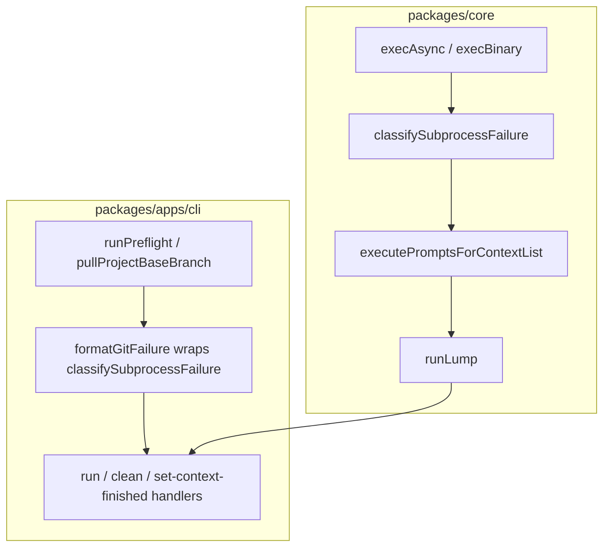

# PRD: Graceful error handling (git auth, remotes, agent exits)

| Field | Value |
| --- | --- |
| **Backlog** | `graceful-error-handling` (priority 1) |
| **Status** | Pending implementation |
| **Packages** | `packages/core` (primary); `packages/apps/cli` (git pre-flight and command surfacing) |

## Problem statement and motivation

Lumpcode runs git and agent subprocesses on almost every meaningful workflow: pre-flight (`git fetch`, `git switch`, `git reset`, `git pull`), lump execution (workspace setup, agent spawn, `git add` / `git commit` / `git push`), status queries (`git fetch` in `getContextStatus`), and operator actions such as `set-context-finished` and `clean`.

When those subprocesses fail, operators today see **low-level, implementation-shaped messages** that bury the actionable cause:

| Layer | Current behavior (examples) |
| --- | --- |
| `execAsync` | `Command git fetch --all failed with error: …` (raw Git stderr / Node `ExecException`) |
| `execBinary` | `Process exited with code 127: …` or spawn `ENOENT` as `err.message` |
| `runPreflight` | `Pre-flight failed while running "git fetch --all" in /path: Command git fetch --all failed with error: …` |
| `executePromptsForContextList` | `Failed to run the command: Process exited with code 1: …. Command: cursor-agent -p "…"` |
| `runLump` | Prefixes again: `Error in runLump: Failed to execute prompts… Original Error: …` |

Common real-world failures — **missing `origin`**, **HTTPS/SSH auth rejection**, **agent binary not installed** — therefore read like internal debug logs. Operators must grep Git or agent output themselves to learn they need `git remote add`, a credential helper, an SSH key, or `cursor-agent` on `PATH`.

This erodes trust in the CLI, blocks onboarding (especially on fresh clones and CI hosts), and makes daemon logs hard to triage. The related backlog item **`better-cli-output`** explicitly depends on this task for clearer failure UX across commands.

## Goals

1. **Classify and rewrite** the most frequent git and agent failure modes into **short, actionable, user-facing messages** (what failed, why it likely failed, what to do next).
2. **Cover three backlog categories explicitly:**
   - Git **authentication / authorization** failures (HTTPS 401/403, credential prompts declined, SSH `Permission denied (publickey)`, token expiry).
   - **Missing or misconfigured remotes** (no `origin`, remote URL unset, fetch/push to unknown remote).
   - **Common agent exit outcomes** (binary not found / not on `PATH`, non-zero exit without useful stderr, timeout, interrupt).
3. **Apply at the points operators actually hit failures** — pre-flight, lump run (agent + git steps that already fail the run), and other CLI git commands that surface errors to the user today.
4. **Preserve diagnostic detail** for maintainers: append or retain raw stderr in verbose paths where feasible; do not discard exit codes.
5. **Stable message phrases** for unit/E2E tests (similar to `branchWorkspaceBusy` and dedicated-dirty guardrail copy).
6. **Optional structured `code` on `--json` failures** where the CLI already uses typed error objects (follow `branchWorkspaceBusy` precedent for at least git-auth and agent-not-found).

## Non-goals

- Rewriting **every** possible git or agent error (infinite long tail); v1 focuses on pattern-matched high-frequency cases with a **generic fallback** that is still cleaner than today.
- Changing **success paths**, retry policies, or daemon scheduling (failed tick still skips; no auto-retry with backoff).
- **Interactive** credential collection (no `git credential fill` prompts from Lumpcode; operators configure git separately).
- Fixing **`getContextStatus`** silently returning `toDo` on fetch failure (status ambiguity is a separate product decision; v1 may log a one-line warning in verbose mode only — see open questions).
- Making **git push failure after a successful agent run** fail the lump run (today push failure is logged but the run may still report success — see open questions; do not silently change semantics without an explicit decision).
- **`command-outputs-docs`** full envelope catalog (follow-up backlog); v1 documents new messages in `commands.md` failure sections only.
- Cloud API / **`lumpcode login`** errors (different domain from git remote auth).
- Windows-specific Git for Windows credential-manager UI behavior beyond message classification.

## User stories / use cases

1. **New project, no remote** — I initialized a repo locally and ran `project-setup` but never added `origin`. `lumpcode run myLump` should tell me to add a remote and verify `git remote -v`, not dump `fatal: 'origin' does not appear to be a git repository` inside a nested prefix chain.
2. **HTTPS auth expired** — Daemon tick fails pre-flight with a message pointing to credential refresh / PAT / `gh auth login`, not only Git’s `Authentication failed for 'https://github.com/…'`.
3. **SSH key missing on CI** — Pre-flight or push fails with guidance to configure deploy keys or HTTPS, referencing `origin` URL scheme when detectable.
4. **Agent not installed** — `"command": "cursor"` lump fails with “`cursor-agent` not found on PATH; install Cursor CLI or override the command module” instead of `spawn cursor-agent ENOENT`.
5. **Agent rejected prompt / usage error** — Non-zero exit (e.g. code 1) with empty stderr still yields a message naming the agent executable and suggesting `--plan` to inspect the resolved command.
6. **Operator using `--json`** — Script receives a stable `code` (e.g. `gitAuthFailed`, `gitRemoteMissing`, `agentNotFound`) in the failure envelope where applicable, plus the human message in `messages`.
7. **Maintainer** — Unit tests feed representative stderr fixtures; E2E uses a mock agent that exits with controlled codes without calling real git hosting.

## Proposed behavior and UX

### Error categories (v1)

| Category | `code` (JSON, when structured) | When detected | User-facing intent |
| --- | --- | --- | --- |
| Git remote missing / invalid | `gitRemoteMissing` | No `origin`, unknown remote name, `not a git repository` at execution workspace | Add/fix remote before running Lumpcode |
| Git auth / permission | `gitAuthFailed` | Auth failed, 403/401, permission denied (publickey), invalid credentials | Fix credentials / SSH / PAT; verify access to remote |
| Git network / host | `gitRemoteUnreachable` | Could not resolve host, connection timed out, SSL errors | Network / VPN / firewall / URL typo |
| Git ref / branch | `gitRefMissing` | unknown revision, bad `projectBaseBranch`, empty remote branch | Fix `projectBaseBranch` in `local.json` or push base branch |
| Agent not found | `agentNotFound` | Spawn `ENOENT`, exit 127, “command not found” in stderr | Install agent CLI or fix `command` module `executable` |
| Agent failed | `agentCommandFailed` | Non-zero exit other than above | Agent failed; check agent logs; use `lump-plan --prompts` |
| Agent timeout | `agentTimedOut` | `execBinary` timeout | Increase timeout or simplify prompt |
| Generic subprocess | `commandFailed` | Unmatched git/shell/agent failure | Shorter wrapper: what step failed + last line of stderr |

Classification is **best-effort pattern matching** on `(command, exit code, stdout, stderr)`; unmatched cases use `commandFailed` with a trimmed generic message (no triple nesting of “Original Error”).

### Message shape (human CLI)

**Requirements for rewritten messages:**

- **One primary sentence** stating the failure in Lumpcode terms (pre-flight, agent step, push, etc.).
- **Likely cause** in plain language when confidence is high (auth vs missing remote).
- **Next steps** as a short bullet or inline list (1–3 items max).
- **Context**: execution workspace path for git pre-flight failures; agent executable name for agent failures; remote name (`origin` by default).
- **Do not** include full prompt text or entire stderr by default (can truncate to last non-empty line or first `fatal:` line).

**Example — missing remote (pre-flight):**

```text
Pre-flight failed: Git remote "origin" is not configured (or not reachable) in /abs/path/to/repo.
Add a remote with `git remote add origin <url>` and verify with `git remote -v`, then retry.
```

**Example — HTTPS auth (pre-flight):**

```text
Pre-flight failed: Git could not authenticate with remote "origin" (https://github.com/org/repo.git).
Refresh credentials (e.g. `gh auth login`, credential manager, or a valid PAT) and ensure the account can read the repository.
```

**Example — SSH auth:**

```text
Pre-flight failed: Git SSH authentication failed for remote "origin" (git@github.com:org/repo.git).
Add an SSH key to the agent or switch the remote to HTTPS; test with `ssh -T git@github.com`.
```

**Example — agent not found:**

```text
Agent command failed: "cursor-agent" was not found on PATH.
Install the Cursor CLI, ensure the binary is on PATH, or change the lump `command` module / preset. Use `lumpcode lump-plan <lumpName> --prompts` to preview the resolved executable.
```

**Example — agent exit 1 (generic):**

```text
Agent command failed: "copilot" exited with code 1.
Review the agent’s output above, fix configuration or quotas, and retry. Use `lumpcode lump-plan <lumpName> --prompts` to inspect the resolved command.
```

### Commands and surfaces (syntax unchanged)

| Command / path | Failure surface | v1 classification scope |
| --- | --- | --- |
| `lumpcode run <lumpName> [--json]` | Pre-flight, engine/agent, workspace setup/teardown | Yes — primary |
| `lumpcode start` / daemon tick | Pre-flight logged to daemon log | Yes — same messages as pre-flight |
| `lumpcode clean [--lumpName] [--contextName] [--json]` | Pre-flight + branch delete git | Yes — git patterns |
| `lumpcode set-context-finished …` | `git push` on base branch | Yes — auth / remote |
| `lumpcode lump-status …` | Indirect via status resolution | Partial — only where errors are already surfaced to user (not silent `toDo`) |
| `lumpcode lump-plan …` | No agent spawn / no pre-flight | Out of scope except validating config load errors (unchanged) |

```bash
lumpcode run <lumpName> [--json]
lumpcode start [--foreground] [--cronSetup '<cron>'] [--lumpName <lumpName>] [--json]
lumpcode clean [--lumpName <lumpName>] [--contextName <contextName>] [--json]
```

### `--json` behavior

Continue emitting **one compact JSON envelope line** on failure (`messages: string[]`, non-zero exit).

**v1 extension (when classifier matches a known category):**

```json
{
  "messages": ["Pre-flight failed: Git could not authenticate with remote \"origin\" …"],
  "data": {
    "code": "gitAuthFailed",
    "category": "git",
    "step": "preflight",
    "remoteName": "origin",
    "executionWorkspacePath": "/abs/path"
  }
}
```

- **`code`** — stable machine identifier from the table above (required in `data` when structured).
- Additional `data` fields are optional and category-specific; scripts must not require fields beyond `messages` for v1 compatibility.
- **`branchWorkspaceBusy`** remains as today (`run` already returns structured `data` for that case).
- Pre-flight and simple string failures that today use `commandFailure(string)` may gain structured `data` by returning `failure({ messages, data })` from handlers where low-cost (at minimum: `run`, `clean`, `set-context-finished`).

Human mode (no `--json`) prints only `messages` — no change to stdout/stderr routing.

### Reduce message nesting

Implementations should **classify once at the lowest layer that has stderr/code**, then propagate a single user message upward:

- `runPreflight` → classified git message (not wrapped again with the raw `execAsync` string).
- `executePromptsForContextList` → classified agent message; `runLump` should **not** prepend another “Original Error” wrapper when the inner message is already user-facing (replace prefix with a short context tag if needed, e.g. `Context "foo": …`).

## Technical approach

### Architecture



### New shared helper(s) in `packages/core`

Add focused modules under `packages/core/src/helpers/` (one type/helper per file per repo convention):

| Module | Responsibility |
| --- | --- |
| `classifySubprocessFailure/` | Input: `{ kind: 'git' \| 'agent', command, executable?, exitCode?, stdout, stderr, spawnError? }`. Output: `{ code, message, details? }`. Pure function; no I/O. |
| (optional) `gitRemoteSummary/` | Read `git remote get-url origin` via existing `execAsync` when formatting messages (CLI pre-flight only; optional URL in message). |

**Pattern matching (v1):** case-insensitive substring / regex list maintained in one file; table-driven tests with fixtures copied from real Git 2.x / common agents. Order matters (check `not a git repository` before generic `fatal:`).

**Git auth heuristics (non-exhaustive):**

- `Authentication failed`, `Invalid username or password`, `403`, `401`, `access denied`, `Permission denied (publickey)`, `Could not read Username`, `terminal prompts disabled`, `HTTP Basic: Access denied`

**Git remote heuristics:**

- `'origin' does not appear to be a git repository`, `No such remote`, `No configured push destination`, `does not have a remote`, `not a git repository`

**Agent heuristics:**

- Spawn `ENOENT` → `agentNotFound`
- Exit `127` or stderr `command not found` → `agentNotFound`
- Timeout message from `execBinary` → `agentTimedOut`
- Exit `130` / signal interrupt → optional `agentInterrupted` or fold into `agentCommandFailed`
- Default non-zero → `agentCommandFailed`

Export from `@lumpcode/core` barrel for CLI use.

### `packages/core` call-site changes

| File | Change |
| --- | --- |
| `helpers/execAsync/main.ts` | Optional: attach `exitCode` / parsed fields to failure `info` (non-breaking). Classification happens at call sites in v1, not inside `execAsync`, to avoid changing every consumer.message format unexpectedly. |
| `helpers/execBinary/main.ts` | Same — keep raw failure shape; classify at agent call site. |
| `helpers/executePromptsForContextList/main.ts` | On agent failure, replace message via `classifySubprocessFailure({ kind: 'agent', … })`. On workspace setup/teardown/git add/commit failures, use `kind: 'git'`. |
| `usages/runLump/main.ts` | Stop double-wrapping classified messages; propagate `data.code` if present (may require widening `Failure<{ message: string }>` to include optional `code`). |

### `packages/apps/cli` call-site changes

| File | Change |
| --- | --- |
| `utils/runPreflight/main.ts` | Classify each failed git step; include `executionWorkspacePath` and failing step name (`fetch`, `switch`, `reset`, `pull`). |
| `utils/setContextToFinishedStatus/main.ts` | Classify push/switch failures. |
| `commands/run/main.ts` | Map structured core/cli failures to JSON envelope with `data.code` when available. |
| `commands/clean/main.ts` | Surface classified git errors from pre-flight / cleanup. |
| Daemon tick logging | Log the same pre-flight string (no special format). |

Keep **`commandFailure(message: string)`** for simple cases; add **`commandFailureStructured({ message, code, … })`** or generalize to accept optional `data` only if it reduces duplication (prefer matching existing `branchWorkspaceBusy` pattern).

### Affected docs

| Doc | Update |
| --- | --- |
| `packages/apps/cli/DOCS/commands.md` | Expand **Fails if** for `run`, `start`, `clean` with categorized examples (auth, remote, agent). |
| `packages/apps/cli/DOCS/get-started.md` | Troubleshooting subsection: remote + auth + agent on PATH before first run. |
| `packages/apps/cli/DOCS/concepts.md` | Pre-flight / run failure: pointer to actionable errors. |
| Root `AGENTS.md` | Note that git/agent subprocess failures are classified for user-facing output. |

No migration guide; document current behavior only.

## Testing strategy

### Unit tests — `classifySubprocessFailure` (`packages/core`)

Fixture-driven table tests (real stderr snippets, no network):

| Fixture | Expected `code` | Message contains (stable substring) |
| --- | --- | --- |
| Git: `fatal: 'origin' does not appear to be a git repository` | `gitRemoteMissing` | `remote "origin"` + `git remote add` |
| Git: `Permission denied (publickey)` | `gitAuthFailed` | `SSH authentication failed` |
| Git: `Authentication failed for 'https://…'` | `gitAuthFailed` | `authenticate` |
| Git: `Could not resolve host` | `gitRemoteUnreachable` | `network` or `resolve` |
| Git: `unknown revision` / bad branch | `gitRefMissing` | `projectBaseBranch` or branch name |
| Agent: spawn ENOENT | `agentNotFound` | `not found on PATH` |
| Agent: exit 127 | `agentNotFound` | |
| Agent: exit 1, empty stderr | `agentCommandFailed` | executable name |
| Agent: timeout | `agentTimedOut` | `timed out` |
| Unmatched stderr | `commandFailed` | no triple `Original Error` |

### Unit tests — integration at call sites

| Area | Cases |
| --- | --- |
| `runPreflight/unit.test.ts` | Mock or stub `execAsync` failure with auth vs remote fixtures → classified message; success path unchanged. |
| `executePromptsForContextList` (core) | Agent failure returns classified message; optional test with mock `command` module executable `nonexistent-binary`. |
| `run/main.ts` or handler test | `--json` failure includes `data.code` for git auth fixture. |

Prefer **real temp git repos** for pre-flight where cheap (missing remote: repo without `git remote add`); avoid mocking `execAsync` when a 5-line repo setup is clearer.

### E2E (`packages/apps/cli/src/e2e/`)

Add scenarios (SEA binary, serial worker):

| ID | Scenario | Assertion |
| --- | --- | --- |
| RUN-E1 | Project without `origin` → `lumpcode run <lump> --json` | Non-zero; `messages` match `gitRemoteMissing` copy; `data.code === 'gitRemoteMissing'` if structured |
| RUN-E2 | Mock agent script exits `127` | Non-zero; `agentNotFound`-style message |
| RUN-E3 | (Optional, if harness can simulate) Pre-flight against remote URL that fails auth | `gitAuthFailed` — may require local `git daemon` or stubbed `GIT_ASKPASS` failing; defer if too heavy |

Extend **`e2e-mock-agent.cjs`** (harness-generated) to support env-driven exit code (e.g. `LUMPCODE_E2E_AGENT_EXIT=127`) without affecting happy-path scenarios.

Run on existing CI matrix (Linux/macOS); Windows when E2E enabled.

### What not to test

- Every Git hosting provider variant (GitHub, GitLab, Bitbucket) — one HTTPS + one SSH fixture suffices.
- Exact stderr wording across all Git minor versions — assert stable Lumpcode phrases, not full Git output parity.

## Acceptance criteria

- [ ] **`classifySubprocessFailure`** (or equivalent) lives in `packages/core`, exported, with fixture unit tests for all v1 categories in the table above.
- [ ] **Pre-flight** (`runPreflight`) returns user-facing messages for git auth, missing remote, and unreachable host — not raw `Command … failed with error` wrappers.
- [ ] **Agent failures** during `lumpcode run` surface `agentNotFound` / `agentCommandFailed` / `agentTimedOut` messages naming the configured executable.
- [ ] **`runLump` / engine** do not prepend redundant `Original Error` chains when the inner message is already classified.
- [ ] **`lumpcode run --json`** includes `data.code` for classified pre-flight and agent failures (minimum); `branchWorkspaceBusy` unchanged.
- [ ] **`set-context-finished`** and **`clean`** classify git auth / remote failures on push or pre-flight respectively.
- [ ] **Daemon log** shows the same pre-flight messages as interactive `run` on auth/remote failure.
- [ ] **E2E**: at least RUN-E1 (no remote) and RUN-E2 (agent exit 127) pass on CI.
- [ ] **Docs** updated (`commands.md`, `get-started.md` or `concepts.md`) with troubleshooting pointers.
- [ ] **`TODO.yml` unchanged** by this PRD task (implementation PR moves entry to `DONE.yml` separately).

## Open questions and risks

| Topic | Question / risk | Recommendation |
| --- | --- | --- |
| Push failure vs run success | Today `executePromptsForContextList` logs push failure but may still return success. | **Decide in implementation PR:** either (A) classify+log only (minimal scope), or (B) fail the run with `gitAuthFailed` — prefer **(B)** for auth/remote push failures only; document behavior change. |
| `getContextStatus` silent fetch fail | Status shows `toDo` when fetch fails. | **Out of v1** unless product wants `lump-status` warning banner; note in release notes. |
| Remote URL in messages | Leaks repo URL to logs. | Include scheme/host only; omit tokens (Git stderr rarely includes tokens). |
| Structured errors beyond `run` | Scope creep across all commands. | v1: `run`, `clean`, `set-context-finished`; others stay string-only until `command-outputs-docs`. |
| Classifier false positives | Generic `fatal:` matched as auth. | Order-specific rules; unit tests for negatives; fallback to `commandFailed`. |
| `dedicated-dirty-env-guardrail` | May land before/after this task. | Orthogonal; dirty-tree message stays separate; both may appear in pre-flight — no merge of codes. |
| Agent-specific codes | Claude/Cursor/Copilot distinct exit codes. | v1: executable-agnostic buckets; revisit if presets document stable codes. |
| Verbose / debug mode | Operators want raw stderr. | Optional `--verbose` on `run` later; v1 may include last stderr line in `commandFailed` only. |
| i18n | English-only messages. | Accept for v1 (CLI is English today). |
| Core `Failure` type widening | `runLump` returns `{ message: string }` only. | Add optional `code?: string` (and `details?`) without breaking callers that read `.message` only. |

## Related backlog

| Item | Relationship |
| --- | --- |
| **`better-cli-output`** | Depends on this task; builds on clearer failure messages for success/progress formatting. |
| **`dedicated-dirty-env-guardrail`** | Complementary pre-flight failure; may add `workingTreeDirty` code later under same classifier family. |
| **`complete-e2e-binary-test`** / **`upgrade-e2e`** | Cross-reference RUN-E1/E2; extend matrix when auth fixtures are feasible. |
| **`preset-agent-commands`** | Agent-not-installed path; presets assume `cursor-agent` / `copilot` on PATH. |
| **`command-outputs-docs`** | Formal `--json` schema for all commands; optional follow-up for full `data` shapes. |
| **`fix-in-start-run-no-double-lump-launch`** | `branchWorkspaceBusy` already structured; keep pattern consistent. |
