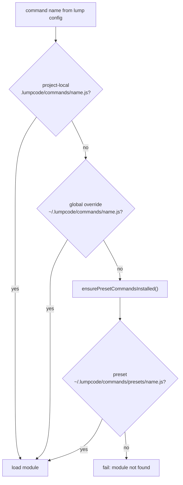

# PRD: Preset agent command modules (Cursor, Copilot)

| Field | Value |
| --- | --- |
| **Backlog** | `preset-agent-commands` · priority **1** |
| **Depends on** | `complete-e2e-binary-test` |
| **Follow-ups** | `reset-presets-command` (restore shipped defaults), `lump-create-interactive` (agent picker), additional presets (`claude`, `codex`, `opencode`, `aider`) |
| **Packages** | `packages/apps/cli` (primary); `packages/apps/cli/cli-types` (types/docs only if preset authoring examples change); `packages/core` unchanged |

## Problem statement and motivation

Today, every Lumpcode user who wants to run a lump with **Cursor Agent** or **GitHub Copilot CLI** must author a custom command module under `.lumpcode/commands/<name>.js` or `~/.lumpcode/commands/<name>.js`, even though the invocation is nearly identical for everyone (`cursor-agent` / `copilot` with a small, stable argv shape).

That creates friction on the critical path:

1. **`lumpcode lump-create`** scaffolds `"command": "claude"`, but there is **no** shipped `claude` preset yet—new users hit “command module not found” unless they copy boilerplate.
2. **Onboarding docs** ([get-started.md](../../../../packages/apps/cli/DOCS/get-started.md)) assume a working agent command module; Cursor and Copilot users must discover [advanced-config.md](../../../../packages/apps/cli/DOCS/advanced-config.md#custom-agent-commands) before their first successful `run`.
3. **Duplication** — this monorepo already maintains working reference modules at [`.lumpcode/commands/cursor.js`](../../../commands/cursor.js) and [`.lumpcode/commands/copilot.js`](../../../commands/copilot.js); those should become the canonical shipped defaults, not copy-paste examples.

Lumpcode should ship **opinionated, tested presets** for the agents we support first (**Cursor**, **Copilot**), install them into the user’s **global config folder**, and resolve them automatically when no project-local or global override exists—without changing lump config’s `"command": "cursor"` string contract.

## Goals

1. **Ship two preset command modules** — `cursor` and `copilot` — derived from the repo’s `.lumpcode/commands/cursor.js` and `.lumpcode/commands/copilot.js`.
2. **Materialize presets under the global config folder** at `~/.lumpcode/commands/presets/<name>.js` (see [Preset file format](#preset-file-format) for the backlog `.json` note).
3. **Extend command resolution** so presets are the **lowest** priority: project-local → global user override → preset fallback.
4. **Keep lump config unchanged** — `command` fields remain bare names (`"cursor"`, `"copilot"`); no flags in the string; agent argv stays inside the module’s `command` export.
5. **Tests** — unit tests for resolution order and preset installation; no requirement to use presets in E2E (mock agent stays harness-owned per [complete-e2e-binary-test.prd.md](./complete-e2e-binary-test.prd.md)).
6. **Documentation** — update user-facing CLI docs to list shipped presets and override behavior.

## Non-goals

- Presets for **`claude`**, **`codex`**, **`opencode`**, or **`aider`** in this task (explicitly deferred).
- **`lumpcode reset-presets`** — separate backlog (`reset-presets-command`); this PRD only lays down on-disk layout and bundle source so that command can copy defaults later.
- **Resumable / session-id presets** — full chat resume (`create-chat`, `contextRunState`, `keepHistory`) is desired long-term ([AGENTS.md](../../../../AGENTS.md)); v1 ships the **simple** cursor/copilot modules from repo root (no `setup` chat bootstrap). A follow-up can upgrade the `cursor` preset to match the richer pattern in `packages/apps/cli/src/fixtures/mockProjects/classic/.lumpcode/commands/cursor.js`.
- **Project-local preset directory** — only global `~/.lumpcode/commands/presets/` in v1.
- **Declarative JSON command modules** for arbitrary user authoring — if JSON is needed at all, it is only for **shipped** presets and still compiles to the existing `CommandModule` contract (see open questions).
- **`lump-create` default agent change** — stub may keep `"claude"` until the `claude` preset exists; docs should mention `"cursor"` / `"copilot"` as ready-made alternatives.
- **Core engine changes** — `CommandFn`, `executePromptsForContextList`, and `@lumpcode/core` stay as-is.
- **Cloud / login** — presets are local OSS; no API coupling.

## User stories / use cases

1. **New user (Cursor)** — I install `cursor-agent`, run `project-setup` and `lump-create`, set `"command": "cursor"` in lump config, and `lumpcode run` works without writing a command module.
2. **New user (Copilot CLI)** — Same with `"command": "copilot"` and `copilot` on `PATH`.
3. **Power user (override)** — I place `~/.lumpcode/commands/cursor.js` with custom `--model` defaults; Lumpcode loads my file and **never** loads the preset for that name.
4. **Project-specific agent** — My team commits `.lumpcode/commands/cursor.js` in the repo; it wins over both global override and preset for that project.
5. **Maintainer** — Preset source lives in the CLI package, is copied into the SEA bundle (or embedded asset), and is covered by resolution unit tests so refactors to `getCommandPath` do not regress.
6. **Future: reset presets** — Operator runs `lumpcode reset-presets` (follow-up) to overwrite `~/.lumpcode/commands/presets/*.js` from the bundle; user overrides at `~/.lumpcode/commands/<name>.js` are untouched.

## Proposed behavior and UX

### Command names and lump config

Users reference presets exactly like custom modules:

```json
{
  "prompt": {
    "promptTemplate": "Refactor @{FILE}",
    "command": "cursor"
  }
}
```

```json
{
  "prompt": {
    "promptTemplate": "Refactor @{FILE}",
    "command": "copilot"
  }
}
```

Per [lump-config.md](../../../../packages/apps/cli/DOCS/lump-config.md): use the **bare** command name; do not embed flags in the string.

### Resolution order (normative)

When lump config (or `registerCommands`) references command name `<name>`, resolve the module file in this order—**first existing file wins**:

| Priority | Path | Role |
| --- | --- | --- |
| 1 | `<projectRoot>/.lumpcode/commands/<name>.js` | Project-local |
| 2 | `~/.lumpcode/commands/<name>.js` | Global user override (non-preset) |
| 3 | `~/.lumpcode/commands/presets/<name>.js` | Shipped default |

Implementation today ([`getCommandPath`](../../../../packages/apps/cli/src/utils/getCommandPath/main.ts)) only checks rows 1–2. Extend it (or a successor `commandModulePath` helper per [unify-paths-and-ids-formatting.prd.md](./unify-paths-and-ids-formatting.prd.md)) to append row 3.

**Failure behavior** — If no file exists at any tier, `loadCommandModule` continues to fail with a clear message, e.g. `Failed to load command module 'cursor': …` / file not found, pointing users to install the agent binary or add a custom module.

### Preset installation (global config)

Presets must exist on disk because command modules load through [`resolveImportable`](../../../../packages/apps/cli/src/utils/resolveImportable/main.ts) at runtime (SEA-safe dynamic `import()`).

**When to install**

- Call `ensurePresetCommandsInstalled({ globalConfigFolderPath })` from the shared run pipeline before resolving commands—at minimum from code paths that invoke `getCommandPath` / `jsConfigToRunLumpInput` (e.g. `run`, `start` tick, `lump-plan`).
- **Idempotent**: if `presets/<name>.js` already exists, do not overwrite (user may have edited preset files directly; full reset is `reset-presets-command`).

**What to install**

- Create `~/.lumpcode/commands/presets/` if missing.
- Copy `cursor.js` and `copilot.js` from bundle source if missing.

**Bundle source layout (repo)**

```
packages/apps/cli/src/presets/commands/
  cursor.js      # copied/adapted from .lumpcode/commands/cursor.js
  copilot.js     # copied/adapted from .lumpcode/commands/copilot.js
```

Build step (ncc / `build:bundle` / `build:sea`) must include these files next to the bundle (same pattern as `schemas/`) **or** embed and extract on install—prefer **self-contained SEA** per project conventions ([embed-schemas-in-sea-bundle](../TODO.yml) backlog for schemas; presets can follow the same approach when feasible).

### Preset file format

**Backlog text** says `~/.lumpcode/commands/presets/{cursor, copilot}.json`.

**Reference implementations** in this repo are **`.js`** modules using `@lumpcode/cli-types` (`defineCommand`, etc.).

**v1 decision (recommended for implementers):** ship **`.js`** presets at `~/.lumpcode/commands/presets/<name>.js` so they load through the existing `CommandModule` + `resolveImportable` path with no new interpreter. Treat `.json` in the backlog as a **documentation typo** unless product explicitly requires JSON (see [Open questions](#open-questions-and-risks)).

### Shipped preset behavior (source of truth)

Adapt from repo root modules (behavioral contract for acceptance tests):

**`cursor`** — executable `cursor-agent`; prompt via `-p`; `--force`; `--model` from `promptItemVariables.model` defaulting to `composer-2.5`.

**`copilot`** — executable `copilot`; prompt via `-p`; `--allow-all-tools`; `--silent`; `--model` from `promptItemVariables.model` defaulting to `auto`.

Both use empty `setup` / `teardown` in v1 (same as source files).

### CLI surface

**No new subcommands** in this task.

Existing commands gain preset resolution transparently:

```bash
lumpcode run <lumpName>
lumpcode start [--foreground] [--lumpName <lumpName>]
lumpcode lump-plan <lumpName> [--plan]
```

Users still need the **agent binary on `PATH`** (`cursor-agent`, `copilot`). Lumpcode does not install those tools.

### Overrides (UX examples)

| User action | Effect |
| --- | --- |
| Nothing | Presets installed under `~/.lumpcode/commands/presets/`; `"command": "cursor"` resolves there |
| `~/.lumpcode/commands/copilot.js` | Global override; preset ignored for `copilot` |
| `.lumpcode/commands/cursor.js` in repo | Project wins for that repository |
| Edit `~/.lumpcode/commands/presets/cursor.js` | Used until reset-presets follow-up restores from bundle |

## Technical approach

### Affected code

| Area | Change |
| --- | --- |
| [`getCommandPath`](../../../../packages/apps/cli/src/utils/getCommandPath/main.ts) | Add third candidate: `path.join(globalConfigFolderPath, 'commands', 'presets', command + '.js')` |
| New util `ensurePresetCommandsInstalled` | `packages/apps/cli/src/utils/ensurePresetCommandsInstalled/` — copy from bundle dir if missing |
| Preset sources | `packages/apps/cli/src/presets/commands/{cursor,copilot}.js` — vendored from `.lumpcode/commands/` |
| Build | `build:bundle` / `build:sea` — copy or embed `presets/commands/*.js` (mirror `schemas/` handling) |
| [`jsConfigToRunLumpInput`](../../../../packages/apps/cli/src/utils/jsConfigToRunLumpInput/main.ts) | Invoke `ensurePresetCommandsInstalled` once per run before `loadCommandModule` |
| Tests | `getCommandPath` unit tests; extend `jsConfigToRunLumpInput` “command resolution” tests with preset tier |
| Docs | `DOCS/advanced-config.md`, `DOCS/lump-config.md`, `DOCS/get-started.md` — preset list + resolution table |

### Resolution implementation sketch

```ts
// getCommandPath — illustrative
return getFirstExistingPath([
  path.join(localConfigFolderPath, 'commands', `${command}.js`),
  path.join(globalConfigFolderPath, 'commands', `${command}.js`),
  path.join(globalConfigFolderPath, 'commands', 'presets', `${command}.js`),
]);
```

`getFirstExistingPath` already returns the first path that passes `fs.access`; do **not** return the last path when none exist (today’s default fallback to `paths[paths.length - 1]` is only safe when callers handle missing files—verify `loadCommandModule` error handling when extending).

### Install implementation sketch

```ts
async function ensurePresetCommandsInstalled({
  globalConfigFolderPath,
  bundlePresetsDir,
}: {
  globalConfigFolderPath: string;
  bundlePresetsDir: string;
}) {
  const destDir = path.join(globalConfigFolderPath, 'commands', 'presets');
  await fs.mkdir(destDir, { recursive: true });
  for (const name of ['cursor', 'copilot'] as const) {
    const dest = path.join(destDir, `${name}.js`);
    if (await exists(dest)) continue;
    await fs.copyFile(path.join(bundlePresetsDir, `${name}.js`), dest);
  }
}
```

Resolve `bundlePresetsDir` from `process.execPath` (SEA) or `__dirname` (Vitest / ncc dev) consistently with [`validateLumpJsonConfig`](../../../../packages/apps/cli/src/utils/validateLumpJsonConfig/main.ts).

### `@lumpcode/cli-types`

Preset files should keep:

```js
import { defineCommand, defineCommandSetup, defineCommandTeardown } from '@lumpcode/cli-types';
```

Published package is optional for end users (runtime is plain ESM/CJS export); types are authoring convenience.

### E2E

Do **not** switch E2E to shipped presets. Harness continues to generate `e2e-agent` (see [complete-e2e-binary-test.prd.md](./complete-e2e-binary-test.prd.md)). Optional later scenario: resolve `cursor` preset in an isolated `HOME` with a mock `cursor-agent` on `PATH`.

### Related backlog (out of scope here)

| Item | Relationship |
| --- | --- |
| `reset-presets-command` | Overwrites `presets/*.js` from bundle; depends on this layout |
| `lump-create-interactive` | May offer cursor/copilot/claude choices |
| `unify-paths-and-ids-formatting` | May fold paths into `commandModulePath()` |
| `embed-schemas-in-sea-bundle` | Same bundling strategy may apply to preset files |

## Acceptance criteria

1. **Source files** — `packages/apps/cli/src/presets/commands/cursor.js` and `copilot.js` match the behavior of `.lumpcode/commands/cursor.js` and `copilot.js` (executable, argv, default models).
2. **Install** — First run (or first `jsConfigToRunLumpInput` resolution) with a fresh `HOME` creates `~/.lumpcode/commands/presets/cursor.js` and `copilot.js` without overwriting existing files.
3. **Resolution** — With only presets present, `"command": "cursor"` loads preset; adding `~/.lumpcode/commands/cursor.js` switches to global override; adding `.lumpcode/commands/cursor.js` switches to project-local.
4. **Order test** — Automated test proves all three tiers for at least one command name.
5. **Missing module** — Unknown command name still fails with an actionable error (no silent fallback to wrong agent).
6. **SEA / CI** — Linux/macOS binary build includes preset assets; resolution works when tests run against bundled layout (or Vitest with explicit `bundlePresetsDir`).
7. **Docs** — `advanced-config.md` documents three-tier resolution including presets; `get-started.md` or `lump-config.md` mentions `"cursor"` and `"copilot"` as built-in names requiring `cursor-agent` / `copilot` on PATH.
8. **Scope** — No changes to `packages/core`; `TODO.yml` unchanged by this PRD task.

## Open questions and risks

| # | Question / risk | Mitigation |
| --- | --- | --- |
| 1 | **`.json` vs `.js`** — Backlog path uses `.json`; runtime only loads JS modules today. | Ship `.js` in v1; confirm with backlog owner or update task text when implementing. |
| 2 | **Quote wrapping in cursor preset** — Source uses `args: ['-p', `"${prompt}"`, …]` (embedded double quotes). | Keep parity with reference module for v1; add integration test against real `cursor-agent` if flaky on Windows. |
| 3 | **`getFirstExistingPath` fallback** — Returns last path when none exist. | Ensure `loadCommandModule` / `fs.access` failure path is explicit; consider returning `undefined` when nothing exists (small API change). |
| 4 | **Preset staleness** — Users keep old presets after CLI upgrade. | Document restart/reset-presets; `reset-presets-command` will overwrite `presets/` only. |
| 5 | **Agent not installed** — Preset resolves but spawn fails. | Covered by `graceful-error-handling` backlog; v1 may still surface raw exit codes. |
| 6 | **`lump-create` defaults to `claude`** — Still no claude preset. | Document cursor/copilot; optional follow-up to change stub or add claude preset. |
| 7 | **Windows SEA `import()`** — Preset paths must be `file://` URLs where required. | Reuse `resolveImportable` / existing Windows SEA rules; add Windows unit test if missing. |
| 8 | **Sidecar vs embedded assets** — Copying presets to `bin/` mirrors schemas. | Align with `embed-schemas-in-sea-bundle` direction long-term; v1 may copy to `bin/presets/commands/` like `bin/schemas/`. |

## Reference: current vs proposed resolution



## Reference: preset argv (v1)

| Preset | `executable` | Notable `args` | Default `model` (`promptItemVariables`) |
| --- | --- | --- | --- |
| `cursor` | `cursor-agent` | `-p`, `--force`, `--model` | `composer-2.5` |
| `copilot` | `copilot` | `-p`, `--allow-all-tools`, `--silent`, `--model` | `auto` |
