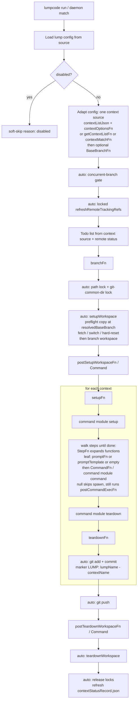
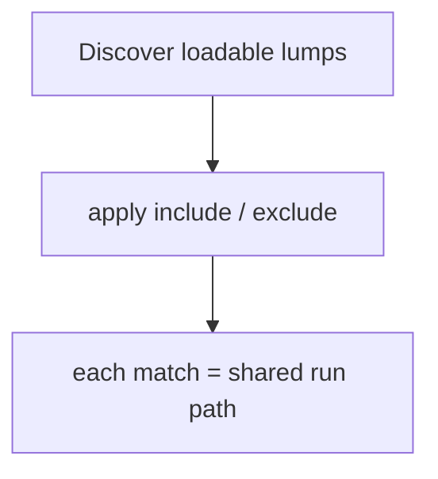
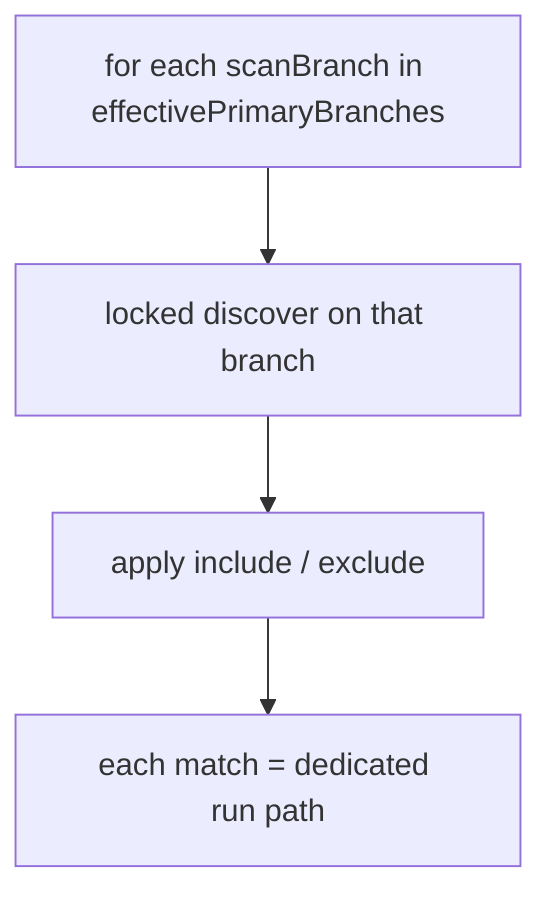
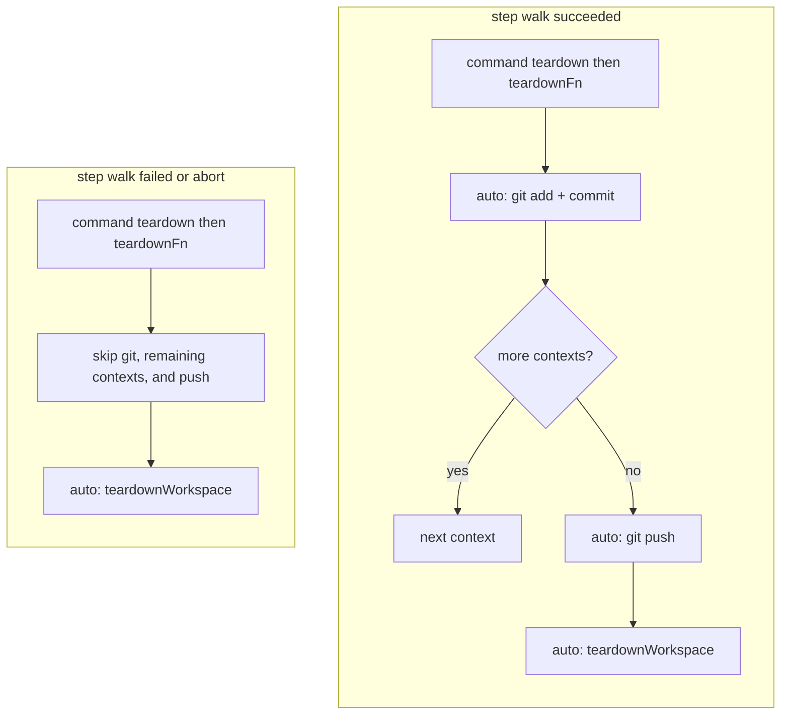

# Advanced Lumpcode CLI configuration

This page is the deep-dive companion to [lump-config.md](./lump-config.md): where that page lists every config field at table depth, this one covers the parts that need more — **hook lifecycle**, **dynamic prompt lists**, **workspace overrides**, and **custom agent command modules**. Operations (daemon, cron, isolated repo copies, workspace presets) live in [concepts.md](./concepts.md); type shapes live in [types.md](./types.md).

Every `*Fn` field below is a [function reference](./lump-config.md#field-forms-conventions) — either:

- an **inline function** — only in `config.js` or `config.ts`, or
- a **string path** to a `.js` or `.ts` module whose **default export** is the function — works in `config.json`, `config.js`, and `config.ts`.

Relative paths resolve from the lump folder.

---

## Hook lifecycle

Canonical timelines for **when** author-facing lump-config hooks run. There are two mode schemas below (`shared` and `dedicated`); a daemon tick wraps the same per-lump path after discovery/filters.

Operator overview (no full hook list): [concepts.md § One run, end to end](./concepts.md#one-run-end-to-end). Locks: [concepts.md § Concurrency and locks](./concepts.md#concurrency-and-locks). Branch roles: [concepts.md § Branch resolution](./concepts.md#branch-resolution). Signatures: [types.md § Hook signatures](./types.md#hook-signatures).

**Legend**

- `auto:` CLI-generated; not a lump-config knob (no `setupWorkspaceFn` / `teardownWorkspaceFn` / `gitCommitMessageFn` in config).
- Context sources are **mutually exclusive**: exactly one of `contextListJson`, `getContextListFn`, or `contextMatchFn` is active per run (the other two are unused).
- `setupFn` / `teardownFn` compose with command-module `setup` / `teardown` (order in the schemas; details under [How `setup` / `teardown` compose](#how-setup--teardown-compose)).

**Worktree vs checkout (both modes)**

| `workspaceStrategy` | Execution-path lock |
| ------------------- | ------------------- |
| `checkout` (default) | Held for the whole run |
| `worktree` | Released after workspace setup returns; branch-path lock + git-common-dir lock still serialize git |

### Shared mode

Execution workspace = `~/.lumpcode/project-copies/<projectName>/`. Pre-flight never mutates the project workspace (source checkout). Config load and context discovery read the **source**. Lump `discoveryBranch(es)` and `--discoveryBranch` are ignored for scheduling (CLI warns if the flag is passed).



**Daemon tick (shared):** discover loadable lumps → apply `--include` / `--exclude` → for each match, run the shared path above (no primary-branch subtick expansion).



### Dedicated mode

Project workspace = execution workspace = the operator checkout. Pre-flight **destructively** resets that checkout. Manual `run` / `lump-plan` / `lump-status` may need `--discoveryBranch` when discovery rules are pattern-only.

```mermaid
flowchart TD
  start["lumpcode run / daemon match on a scan branch"] --> resolve["Resolve concrete discoveryBranch"]
  resolve --> dLocks["auto: path lock + git-common-dir lock"]
  dLocks --> dPre["auto: discovery preflight checkout<br/>at discoveryBranch<br/>fetch / switch / hard-reset"]
  dPre --> load["Load lump config from checkout"]
  load --> disabled{"disabled?"}
  disabled -->|yes| skip["soft-skip reason: disabled<br/>release locks"]
  disabled -->|no| allow["auto: discovery allowlist vs primaryBranches"]
  allow --> adapt["Adapt config: one context source<br/>contextListJson + contextOptionsFn<br/>or getContextListFn or contextMatchFn<br/>then optional BaseBranchFn"]
  adapt --> gate["auto: concurrent-branch gate"]
  gate --> refresh["auto: locked refreshRemoteTrackingRefs"]
  refresh --> todo["Todo list from context source + remote status"]
  todo --> branchFn["branchFn"]
  branchFn --> locks["auto: adopt or acquire path lock<br/>git-common-dir lock at mutations"]
  locks --> setup["auto: setupWorkspace<br/>preflight checkout at resolvedBaseBranch<br/>fetch / switch / hard-reset<br/>then branch workspace"]
  setup --> postSetup["postSetupWorkspaceFn / Command"]
  postSetup --> setupFn

  subgraph perContext ["for each context"]
    direction TD
    setupFn["setupFn"] --> cmdSetup["command module setup"]
    cmdSetup --> walk["walk steps until done:<br/>StepFn expands functions<br/>leaf: promptFn or promptTemplate or empty<br/>then CommandFn / command module command<br/>null skips spawn, still runs postCommandExecFn"]
    walk --> cmdTd["command module teardown"]
    cmdTd --> tdFn["teardownFn"]
    tdFn --> git["auto: git add + commit<br/>marker LUMP: lumpName - contextName"]
  end

  git --> push["auto: git push"]
  push --> postTd["postTeardownWorkspaceFn / Command"]
  postTd --> teardownWs["auto: teardownWorkspace"]
  teardownWs --> unlock["auto: release locks<br/>refresh contextStatusRecord.json<br/>manual run: restore prior branch"]
```



**Daemon tick (dedicated):** for each scan branch from `effectivePrimaryBranches` → locked discover on that branch → apply `--include` / `--exclude` → for each match, run the dedicated path above (pass effective discovery into the run).



### Failure and teardown (both modes)

After **successful** workspace setup:

- Per-context `teardownFn` (and composed command `teardown`) **always** runs after that context’s step-walk attempt (success or failure). Soft-fail: errors are logged; they do not block git or become the run Failure.
- Workspace teardown **always** runs on any exit after setup succeeded.
- On step-walk failure (including abort): skip that context’s git, remaining contexts, and push.



### `contextRunState`

A mutable bag scoped to **one context execution**. Not shared across contexts, batches, or runs. The same object reference is passed into every hook below — any of them can read **or** mutate it. The "typical use" column is convention, not enforcement.


| Stage                          | Typical use                                                                        |
| ------------------------------ | ---------------------------------------------------------------------------------- |
| `setupFn`                      | Seed the bag — its returned `{ contextRunState: { … } }` becomes the initial value |
| Command module `setup`         | Namespaced under `contextRunState["<commandName>Setup"]`                           |
| `promptFn`                     | Read (e.g. interpolate previous results into prompt text)                          |
| `commandFn`                    | Read (e.g. switch `executable` / `args` based on a flag)                           |
| `postCommandExecFn`            | Mutate (parse stdout, set flags for later steps) or return follow-on steps |
| Dynamic `steps` function | Read (gate the next prompt)                                                        |
| `teardownFn`                   | Read the accumulated `contextRunState`                                             |


Type: [types.md](./types.md#contextrunstate).

---

## Hook reference

Detailed shapes live in [types.md](./types.md); runnable code lives in [examples.md](./examples.md). This table summarises **purpose, gotchas, and where to look**.

### Discovery


| Hook | Purpose | Gotcha | Example |
|------|---------|--------|---------|
| [`getContextListFn`](./types.md#getcontextlistfn) | Return a fully custom `Context[]` (e.g. ticket queue, external API) | `variables` map values **must be strings** — they feed prompt substitution and git paths | [Example 2](./examples.md#2-feature-ticket-queue--strict-dependency-order) |
| [`contextMatchFn`](./types.md#contextmatchfn) | Per-file matcher: Lumpcode walks every `CodeBasePath` and calls you once per file/dir with `codeBasePath`, the full `codeBasePaths` list, and `lumpVariables` | Multiple files returning the same `contextName` **merge** into one context (variables and options merge; later files override); use `codeBasePaths` for cross-file skip or merge logic | [Examples 3 & 4](./examples.md#3-test-coverage-sweep--add-a-test-next-to-every-untested-module) |
| [`contextOptionsFn`](./types.md#contextoptionsfn) | Attach `priority` / `dependsOnContexts` to `contextListJson`-derived contexts | **Only** runs with `contextListJson`; ignored for `getContextListFn` / `contextMatchFn` (those attach `options` on their returned data). `dependsOnContexts` may use `<otherLumpName>/<contextName>` for cross-lump deps — see [lump-config.md § Context ordering](./lump-config.md#context-ordering-and-cross-lump-dependencies) | [Example 7](./examples.md#7-cross-lump-dependency--run-after-another-lump-finishes) |

### Per-context lifecycle


| Hook | Purpose | Gotcha |
|------|---------|--------|
| [`branchFn`](./types.md#branchfn) | Override the default `lump/<lumpName>/<contextNames…>` branch name | Returns **one** branch name for the whole batch (all contexts in `numberOfContextsPerBranch`) |
| [`setupFn`](./types.md#setupfn) | Seed `contextRunState` before the prompt loop for one context | Runs once per context index, **not** once per prompt item |
| [`teardownFn`](./types.md#teardownfn) | Cleanup, metrics, post-processing after all prompt items for one context | Receives the accumulated `contextRunState` |


### Per-step


| Hook | Purpose | Gotcha |
|------|---------|--------|
| [`promptFn`](./types.md#promptfn) | Build prompt text with custom logic (inject `contextRunState`, branch on `stepIndex`, …) | Mutually exclusive with `promptTemplate` on the same item; per-item, not per-context |
| [`postCommandExecFn`](./types.md#postcommandexecfn) | Parse the agent's stdout and stash flags on `contextRunState`, or return follow-on steps nested under this leaf | `commandResult` is **raw stdout** (string). Returned steps are runtime-only (not expanded by `lump-plan`); JS/TS may return a solo item (CLI normalizes like `StepFn`) |


---

## `promptFn`

Use `promptFn` when `promptTemplate` is not enough — it gives you fine-grained control over how each prompt is built (inject `contextRunState` from a previous step, switch on `stepIndex`, run any custom logic). Inline in `config.js` / `config.ts`, or as a [function reference](./lump-config.md#field-forms-conventions) string path from any config format.

```js
export default {
  baseBranch: 'main',
  contextListJson: { FILE: 'src/{NAME}.ts' },
  command: 'copilot',
  steps: [
    {
      promptFn: ({ context, contextRunState }) => {
        const focus = contextRunState.perfIssues ? 'performance' : 'general code quality';
        return `Review @${context.variables.FILE}, focusing on ${focus}.`;
      },
    },
  ],
};
```

`promptFn` and `promptTemplate` are **mutually exclusive** on the same prompt item.

---

## Dynamic `steps`

In `config.js` or `config.ts`, an element of `steps` may be a **function** (`StepFn`, alias of `LumpJsConfigStepsFn`) that receives the same inputs as a `promptFn` (without `stepVariables`) and returns **another** `steps` value — an array, or a solo item (object, string, or nested dynamic function), or an empty array to expand to nothing. A solo `steps: fn` (not wrapped in an array) is also valid in JS/TS configs and is normalized to `[fn]`.

This enables branching workflows:

```js
export default {
  baseBranch: 'main',
  contextListJson: { FILE: 'src/{NAME}.ts' },
  command: 'copilot',
  steps: [
    {
      promptTemplate: 'Does @{FILE} need a README section? Reply YES or NO only.',
      postCommandExecFn: ({ commandResult, contextRunState }) => {
        contextRunState.needsDocs = commandResult.trim().toUpperCase().includes('YES');
      },
    },
    ({ contextRunState }) =>
      contextRunState.needsDocs
        ? [{ promptTemplate: 'Add minimal module docs for @{FILE}.' }]
        : [],
  ],
};
```

Full runnable variant: [Example 6](./examples.md#6-conditional-follow-up--only-do-step-b-if-step-a-says-so). For a `postCommandExecFn` that returns the *next iteration* of its own steps, giving you a build-or-test loop that retries with the failure output, see [Example 8](./examples.md#8-retry-until-green--gate-every-context-on-your-own-command).

### `stepIndex` paths

For static items, `stepIndex` is a number (`0`, `1`, …). Inside arrays returned by a function item, nested items receive `stepIndex` as `number[]` — e.g. `[1, 0]` for the first nested prompt under function item `1`. Deeper nesting grows the array.

### `registerCommands`

A tag top-level `command` is pre-registered automatically. If the **only** reference to a **different** custom `command` name appears inside a dynamic function return, register it up front:

```json
"registerCommands": ["my-agent"]
```

Otherwise lazy loading may throw when the nested array resolves. The lump `command` tag does not need this list.

---

## Custom agent commands

Place modules at:

1. `.lumpcode/commands/<name>.ts` or `.lumpcode/commands/<name>.js` — **project-local** (`.ts` wins when both exist)
2. `~/.lumpcode/commands/<name>.ts` or `~/.lumpcode/commands/<name>.js` — **global user override**
3. `~/.lumpcode/commands/presets/<name>.js` — **shipped preset** (installed automatically on first run; **`.js` only**)

Reference them from `command` fields by **string name** (`"my-agent"`, `"cursor"`, `"copilot"`, `"claude-code"`, `"opencode"`, `"codex"`), same as built-in names. **First existing file wins** in the order above.

### Shipped presets

Lumpcode ships ready-made modules for common CLI agents. Set `"command": "cursor"`, `"copilot"`, `"claude-code"`, `"opencode"`, or `"codex"` in lump config — no custom module required. You still need the agent binary on `PATH`.

| Preset name | Agent binary | Default model |
| ----------- | ------------ | ------------- |
| `cursor` | `cursor-agent` | `auto` |
| `copilot` | `copilot` | `auto` |
| `claude-code` | `claude` | omit `--model` when unset |
| `opencode` | `opencode` | omit `-m` when unset |
| `codex` | `codex` | omit `--model` when unset |

On `npm install`, `npm update`, or standalone install via `install.sh`, shipped preset files are reinstalled into `~/.lumpcode/commands/presets/` (overwriting prior copies there). On first `run`, `start`, or `lump-plan`, any still-missing preset files are copied the same way without overwriting files already there. To restore shipped defaults after editing presets manually, run `lumpcode reset-presets`.

Override a preset by placing `~/.lumpcode/commands/<name>.js` (or `.ts`) (global) or `.lumpcode/commands/<name>.js` (or `.ts`) (project-local).

### Preset options (`model`, `agentPermissions`)

Shipped presets read their options from **`lumpVariables`** (lump-wide) and **`stepVariables`** (per step). For both options, **step overrides lump**; the preset default applies when neither is set.

| Option | Type | Default | Effect |
| ------ | ---- | ------- | ------ |
| `model` | string | `auto` (omit for Claude Code / OpenCode / Codex) | Passed to the agent as `--model` / `-m` — e.g. a cheap model for an analysis step and a stronger one for the edit step. Claude Code, OpenCode, and Codex omit the flag when unset (CLI default applies; OpenCode passes `provider/model` unchanged when set). ChatGPT-backed Codex rejects `auto`. |
| `agentPermissions` | object | `{}` | Preset-specific permission scoping — see [Agent permissions for presets](#agent-permissions-for-presets) |

TypeScript contracts for these keys (closed shapes, no index signature) are exported from [`@lumpcode/cli-utils`](https://www.npmjs.com/package/@lumpcode/cli-utils): `CursorPresetLumpVariables` / `CursorPresetStepVariables`, `CopilotPresetLumpVariables` / `CopilotPresetStepVariables`, `ClaudeCodePresetLumpVariables` / `ClaudeCodePresetStepVariables`, `OpenCodePresetLumpVariables` / `OpenCodePresetStepVariables`, `CodexPresetLumpVariables` / `CodexPresetStepVariables`, plus `PresetSessionStepVariables` (step-only `newChat` / `chatIdIndex`), and the matching `*AgentPermissions` types. Parameterize `defineConfig<V, SV>` with those types (or `& { myFlag: boolean }`) for compile-time checking — see [types.md](./types.md#typed-variables-v--sv).

```js
{
  command: 'copilot',
  lumpVariables: { model: 'auto' },          // lump-wide default
  steps: [
    { promptTemplate: 'Analyze @{FILE}.', stepVariables: { model: 'gpt-5' } }, // overrides for this step
    { promptTemplate: 'Apply the fixes to @{FILE}.' },                          // falls back to lump-wide 'auto'
  ],
}
```

### Agent permissions for presets

Shipped presets run headless (no approval prompts). By default they do **not** override your agent configuration beyond CLI flags for non-interactive execution and workspace scoping.

| Preset | Headless flags | Permissions |
| ------ | -------------- | ----------- |
| `cursor` | `-p`, `--force`, `--trust`, `--workspace`, `--sandbox enabled` | User Cursor config applies (`~/.cursor/cli-config.json`, repo `.cursor/cli.json`). Optional `agentPermissions.cursorConfigDir` sets `CURSOR_CONFIG_DIR` to a user-maintained directory. |
| `copilot` | `-p`, `--no-ask-user`, `--silent` | Preset denies agent `git commit` / `git push` via `--deny-tool`. Optional `writablePaths` and `denyShell` on `agentPermissions`. Never `--yolo` or `--allow-all-paths`. |
| `claude-code` | `-p`, `--session-id`, optional `--model`, `--permission-mode` (default `acceptEdits`) | Preset always denies agent `git commit` / `git push` via `--disallowedTools` (`Bash(git commit *)`, `Bash(git push *)`). Optional `permissionMode`, `allowedTools`, `disallowedTools`, `bare`, `addDirs`. |
| `opencode` | `run`, `-s`, optional `-m`, `--auto` (default on) | Optional `auto` (set `false` to omit `--auto`) and `agent`. No built-in git deny flags — deny git write in OpenCode config; Lumpcode owns marker commits. |
| `codex` | `exec` options then `resume`, optional `--model`, `--sandbox` (default `workspace-write`) | Optional `sandbox` / `addDirs` on parent `codex exec` (before `resume`); `dangerouslyBypassApprovalsAndSandbox` only when explicitly `true`. Never implies the dangerous bypass. No built-in git deny flags — deny git write in Codex config; Lumpcode owns marker commits. |

Set `agentPermissions` on **`lumpVariables`** or per-step **`stepVariables`** (step overrides lump, same as `model` — see [Preset options](#preset-options-model-agentpermissions)):

```js
{
  command: 'cursor',
  lumpVariables: {
    model: 'auto',
    agentPermissions: {
      cursorConfigDir: '.lumpcode/cursor',
    },
  },
}
```

```js
{
  command: 'copilot',
  lumpVariables: {
    agentPermissions: {
      writablePaths: ['packages/apps/cli/src/**'],
      denyShell: ['shell(rm)'],
    },
  },
}
```

```js
{
  command: 'claude-code',
  lumpVariables: {
    model: 'sonnet',
    agentPermissions: {
      permissionMode: 'acceptEdits',
      addDirs: ['/tmp'],
    },
  },
}
```

```js
{
  command: 'opencode',
  lumpVariables: {
    model: 'provider/model',
    agentPermissions: {
      auto: true,
      agent: 'build',
    },
  },
}
```

```js
{
  command: 'codex',
  lumpVariables: {
    agentPermissions: {
      sandbox: 'workspace-write',
      addDirs: ['/tmp'],
    },
  },
}
```

**Recommended Cursor setup for Lumpcode:** maintain a dedicated config directory with a `cli-config.json` that denies agent git operations (Lumpcode owns marker commits). Point lumps at it with `cursorConfigDir`:

```json #cli-config.json
{
  "version": 1,
  "editor": { "vimMode": false },
  "permissions": {
    "allow": ["Write(**)", "Read(**)", "Shell(*)"],
    "deny": ["Shell(git:commit*)", "Shell(git:push*)"]
  }
}
```

Without `cursorConfigDir`, Cursor may still run `git commit` or `git push` if your own Cursor config allows it—use a dedicated config directory for unattended daemon runs.

**OpenCode / Codex git:** the shipped presets do not add deny flags for git write. Configure those agents so they cannot `git commit` / `git push`; Lumpcode owns marker commits.

Each module exports:


| Export     | Required | Description                                                      |
| ---------- | -------- | ---------------------------------------------------------------- |
| `command`  | **Yes**  | Same contract as `commandFn` in [types.md](./types.md#commandfn) |
| `setup`    | No       | Composed with the lump's `setupFn` (see below)                   |
| `teardown` | No       | Composed with the lump's `teardownFn` (see below)                |


For editor hints, install [`@lumpcode/cli-utils`](https://www.npmjs.com/package/@lumpcode/cli-utils) (preferred) or soft-aligned [`@lumpcode/cli-types`](https://www.npmjs.com/package/@lumpcode/cli-types) and use `defineCommand`, `defineCommandSetup`, `defineCommandTeardown` (or `defineCommandModule` for the whole file) in **`.ts`** or **`.js`** command modules. Helpers accept `<V, SV>` so refined lump/step bags are preserved:

```js
import { defineCommand, defineCommandSetup } from '@lumpcode/cli-utils';

export const command = defineCommand(({ prompt, stepVariables }) => ({
  executable: 'my-agent',
  args: ['--message', prompt],
}));

export const setup = defineCommandSetup(async () => ({}));
```

### `workspacePath` vs `projectRoot` in `command`

Lump configs do **not** define `projectRoot`; the CLI resolves it as the directory that contains `.lumpcode/`. Both fields below are runtime parameters on your `CommandFn`:

- **`projectRoot`** — **project workspace**: the source checkout where `.lumpcode/` lives (always your repo in `shared` mode; same as the execution workspace in `dedicated` mode).
- **`workspacePath`** — **branch workspace**: where the agent process runs for this lump (the engine sets `cwd: workspacePath` for you). With `workspaceStrategy: "checkout"`, this equals the execution workspace (project copy in `shared`, checkout in `dedicated`). With `"worktree"`, it is a linked worktree under `.lumpcode/worktrees/<branch>/` inside the execution workspace. See [concepts.md § Three workspaces](./concepts.md#three-workspaces) and [local-config.md](./local-config.md).

The CLI also resolves an **execution workspace** (git repo root after pre-flight)—not passed to `CommandFn`. In `shared` mode that is `~/.lumpcode/project-copies/<projectName>/`; in `dedicated` mode it matches `projectRoot`.

### How `setup` / `teardown` compose

Lumpcode wraps the lump-level `setupFn` and `teardownFn` to also run every loaded command module's `setup` / `teardown`, in this order:


| Stage    | Order                                                                                |
| -------- | ------------------------------------------------------------------------------------ |
| Setup    | lump `setupFn` first → then each command module's `setup` (registration order)       |
| Teardown | each command module's `teardown` first (registration order) → then lump `teardownFn` |


State merge in `contextRunState`:

- The lump's `setupFn` returns `{ contextRunState }` — its keys go directly into the bag.
- Each command module's `setup` return goes under a **namespaced key**: `contextRunState["<commandName>Setup"]`. Namespacing prevents two modules from clobbering each other.

---

## Workspace handling

Per-lump git setup is generated by the CLI from the execution workspace (resolved at pre-flight), `local.json` `workspaceStrategy`, and the lump's `baseBranch`. There are **no** `workspaceSetup`, `setupWorkspaceFn`, or `teardownWorkspaceFn` knobs in lump config. Optional `postSetupWorkspaceFn` / `postSetupWorkspaceCommand` run **after** that generated setup (branch workspace exists) and **before** per-context `setupFn`. Optional `postTeardownWorkspaceFn` / `postTeardownWorkspaceCommand` run **before** generated teardown (workspace still exists). `lump-plan` skips both. These commands are not under `gitCommonDirLock`; do not put git mutations here.

| `workspaceStrategy` | Behavior |
| ------------------- | -------- |
| `checkout` (default) | Main worktree: fetch / switch / hard-reset `baseBranch`, then `git switch -c` lump branch; teardown switches back to the lump's resolved `baseBranch`. |
| `worktree` | Main worktree stays on the lump's resolved `baseBranch`; agent runs in `.lumpcode/worktrees/<branch>/`; teardown removes the worktree. |

Pick `mode` (`shared` / `dedicated`) and `workspaceStrategy` in [local-config.md](./local-config.md). Worktrees are always created under the execution workspace (project copy in `shared`, checkout in `dedicated`).

---

## Related documentation

- [lump-config.md](./lump-config.md) — Field reference
- [local-config.md](./local-config.md) — Per-machine `local.json` (`mode`, `primaryBranch`, `workspaceStrategy`)
- [concepts.md](./concepts.md) — Daemon, pre-flight, status lifecycle
- [types.md](./types.md) — Hook signatures
- [examples.md](./examples.md) — Runnable lump configs
- [commands.md](./commands.md) — `run`, `start`, `daemon-status`, `clean`

