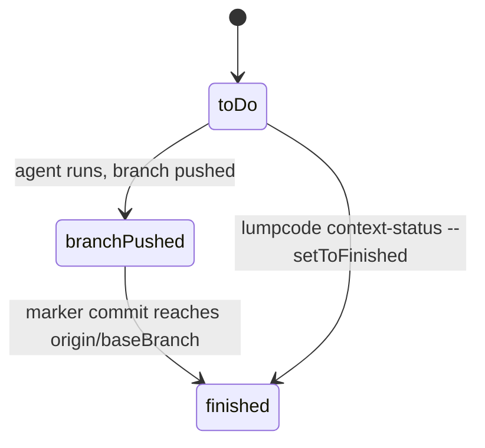

# Lumpcode concepts

This page is the **mental model** for Lumpcode CLI: **agent loop campaigns** (called **lumps**), contexts, status, how one run flows through git, and when to use `lumpcode run` vs `lumpcode start`. Agent work is reviewed through PR merge. Tutorial: [get-started.md](./get-started.md). Field reference: [lump-config.md](./lump-config.md). Commands: [commands.md](./commands.md).

## Core terms


| Term              | Meaning                                                                                                                                                                                                          |
| ----------------- | ---------------------------------------------------------------------------------------------------------------------------------------------------------------------------------------------------------------- |
| **Project**       | A git repo containing both `.git/` and `.lumpcode/`. The CLI stores shared settings in `.lumpcode/project.json` and per-lump configs under `.lumpcode/lumps/` ([project-config.md](./project-config.md)).    |
| **Lump**          | One **agent loop campaign** in `.lumpcode/lumps/<lumpName>/`: context discovery, prompt(s), agent command.                                                         |
| **Context**       | One **unit of work** inside a lump (component, file, group of files, ticket). Has a unique `name` as identifier and string `variables` substituted into prompts as `{VAR}`.                                                    |
| **Prompt step**   | One agent invocation. Multiple steps via `steps`; hooks can branch between them ([lump-config.md](./lump-config.md#prompt-configuration), [advanced-config.md](./advanced-config.md#dynamic-steps)). |
| **Batch**         | The set of contexts processed in one `run` / daemon tick (often one context, more if `numberOfContextsPerBranch > 1`).                                                                                           |
| **Tick**          | One scheduler iteration: for each enabled lump, run the same engine path as `lumpcode run <lumpName>`.                                                                                                           |
| **Work branch**   | Branch Lumpcode creates/updates for the batch. Default `lump/<lumpName>/<contextName…>`, customizable with `branchFn`.                                                                                           |
| **Marker commit** | Commit whose subject is exactly `LUMP: <lumpName> - <contextName>`. **Not configurable** so `clean`, `lump-status`, and `context-status` stay aligned with the engine.                                           |
| **projectBaseBranch** | Branch declared in `.lumpcode/local.json`. Lumpcode pulls it before every run, lumps default to it as their `baseBranch`, and status is judged against `origin/<projectBaseBranch>`. |
| **baseBranch**  | Per-lump override of `projectBaseBranch`. Use when one lump needs to branch off a different upstream (e.g. a long-lived release branch).                                                                          |
| **mode**        | `shared` or `dedicated` (in `.lumpcode/local.json`). Decides whether Lumpcode operates on the current checkout or a separate copy under `~/.lumpcode/project-copies/<projectName>/`. |

**Status** — Per-context progress, derived from **remote** git history and cached in `.lumpcode/lumps/<lumpName>/contextStatusRecord.json`:


| Status         | Meaning                                                           |
| -------------- | ----------------------------------------------------------------- |
| `toDo`         | No marker commit for this context on any remote ref yet           |
| `branchPushed` | Marker commit exists on a branch other than `origin/<baseBranch>`        |
| `finished`     | Marker commit is an ancestor of `origin/<baseBranch>` (typically merged) |


Repeated `run` or daemon ticks are **resumable**: finished contexts are skipped until you change remote history or use `context-status` to mark done manually.

**Ordering:** Per-context `options.priority` (lower runs sooner) and `options.dependsOnContexts` gate which `toDo` contexts are eligible in a batch. A dependency must be **`finished`** on the remote base branch; `branchPushed` does not count. Same-lump deps use the context `name`; cross-lump deps use `<otherLumpName>/<contextName>` (see [types.md § Context](./types.md#context) and [examples.md § 7](./examples.md#7-cross-lump-dependency--run-after-another-lump-finishes)).

**Safety:** Lumpcode does **not** push routine agent work to `baseBranch`; work lives on `lump/<lumpName>/…` branches for normal review and merge. Cap how many such branches are in flight with **`maximumNumberOfConcurrentBranches`** (per lump or default in `project.json`).

## Three workspaces

Lumpcode uses three path concepts during a run. Engine and command-module APIs keep the historical names `projectRoot` and `workspacePath`; CLI internals use `executionWorkspacePath` for the middle layer.

| Concept | Engine / command API | Meaning |
| ------- | -------------------- | ------- |
| **Project workspace** | `projectRoot` | Source checkout where `.lumpcode/` lives. In `shared` mode your editor clone is never touched; config and history paths are always under this tree. |
| **Execution workspace** | *(CLI only)* | Git repo root Lumpcode runs in after pre-flight: project copy in `shared` mode, the checkout itself in `dedicated` mode. |
| **Branch workspace** | `workspacePath` on `CommandFn` / `SetupWorkspaceFn` | Where the agent and per-context `git add` / `git commit` run for this lump. With `workspaceStrategy: "checkout"`, equals the execution workspace. With `"worktree"`, a linked tree under `.lumpcode/worktrees/<branch>/` inside the execution workspace. |

```text
shared mode:
  project workspace     ~/your-repo/          (untouched)
  execution workspace   ~/.lumpcode/project-copies/<projectName>/
  branch workspace      same as execution (checkout) OR .../worktrees/lump/... (worktree)

dedicated mode:
  project workspace = execution workspace = your checkout
  branch workspace    checkout: same path; worktree: .lumpcode/worktrees/...
```

There are **three subcommands whose names include “status”** (not the same thing as the three **status values** `toDo` / `branchPushed` / `finished` in the table above): do not confuse **`daemon-status`** (daemon process), **`lump-status`** (recompute all context rows from remote git), and **`context-status`** (one context row). Comparison table: [commands.md § Three commands…](./commands.md#three-commands-that-mention-status).

## One run, end to end

```mermaid
flowchart LR
  start["lumpcode run myLump"]
  preflight["Pre-flight: pull projectBaseBranch<br/>(in copy or in place per mode)"]
  discover["Discover contexts<br/>contextListJson / fn / matchFn"]
  checkout["Pull lump baseBranch<br/>work branch lump/myLump/..."]
  agent["Run agent with prompt"]
  history["Optional: append to history/<context>.json<br/>when keepHistory is true"]
  commit["git commit<br/>LUMP: myLump - ctx"]
  push["git push origin"]
  refresh["Refresh contextStatusRecord.json"]
  back["Switch back to projectBaseBranch"]
  start --> preflight --> discover --> checkout --> agent --> history --> commit --> push --> back --> refresh
```




Pre-flight resolves the **execution workspace** from `local.json.mode`: the checkout itself in `dedicated` mode, or a copy under `~/.lumpcode/project-copies/<projectName>/` in `shared` mode—see [Pre-flight and modes](#pre-flight-and-modes) and [Three workspaces](#three-workspaces).

When a lump sets **`keepHistory: true`**, each prompt step appends prompt text and agent output to `.lumpcode/lumps/<lumpName>/history/<contextName>.json` on disk (gitignored by `project-setup`). See [lump-config.md § Prompt run history](./lump-config.md#prompt-run-history-keephistory).

## Status lifecycle




## When to use `run` vs `start` (daemon)

- **`lumpcode run <lumpName>`** — Run **one tick** for one lump, then exit. Best for **sporadic** work: tickets you step through locally, one-off codemods, or anything you start and review in the same session.
- **`lumpcode start`** — **Scheduler**: on a cron (default every 5 minutes), runs sequentially **every** lump in the project that has a loadable `config.json`, `config.js`, or `config.ts`, skipping lumps with `"disabled": true`. Best for **sustained agent loop campaigns**: run it on a **machine that stays on** (your dev box or a small remote server with the same git push access). You merge good branches; the next tick picks up the next eligible context.

Useful pairings on a server:

- **`maximumNumberOfConcurrentBranches`** (per lump or default in `project.json`) — caps how many open `lump/<lumpName>/*` branches on `origin` exist before a run is skipped (local-only branches are not counted). See [lump-config.md](./lump-config.md#optional-top-level-fields).
- **`mode: "dedicated"`** in `.lumpcode/local.json` — on a server you don't develop on, skip the copy and run pre-flight directly on the checkout. Pre-flight destructively resets the checkout to `projectBaseBranch` before each tick. See [Pre-flight and modes](#pre-flight-and-modes).
- **`"disabled": true`** on a lump — on the next tick, the daemon skips that lump without stopping the scheduler.

**Daemon files** (under `~/.lumpcode/daemons/`):


| File                                 | Role                                               |
| ------------------------------------ | -------------------------------------------------- |
| `<projectName>.daemon.pid`           | PID of the foreground scheduler child              |
| `<projectName>.daemon.log`           | Child stdout/stderr                                |
| `<projectName>.daemon.meta.json`     | Stores `cronSetup` for `restart` / `daemon-status` |


**Common flags:** `lumpcode start --foreground` (blocking), `lumpcode start --cronSetup '*/10 * * * *'`. Inspect: `lumpcode daemon-status`. Stop: `lumpcode stop`. Restart: `lumpcode restart`.

**Tick behavior:** list `.lumpcode/lumps/*`, keep directories with loadable `config.json`, `config.js`, or `config.ts`, skip disabled lumps, then run the same engine path as `lumpcode run <lumpName>` for each.

Full flag reference: [commands.md](./commands.md).

## Pre-flight and modes

Before every `run` and every daemon tick, Lumpcode runs a **pre-flight** that:

1. Resolves the execution workspace from `local.json.mode`.
2. In that workspace runs `git fetch --all`, switches to `projectBaseBranch`, `git reset --hard origin/<projectBaseBranch>`, then `git pull`.

After pre-flight, each lump prepares git inside the execution workspace according to `local.json.workspaceStrategy` (default `checkout`):

- **`checkout`:** fetch/pull `baseBranch`, create a fresh `lump/<lumpName>/<context…>` branch in the main worktree, run, commit, push, then switch back to `projectBaseBranch`.
- **`worktree`:** add a linked worktree at `.lumpcode/worktrees/<branch>/` (paths mirror branch segments), run the agent there, commit, push, then remove the worktree. The main worktree stays on `projectBaseBranch`.

The next lump in the same tick starts from a clean, known state.

| `local.json.mode` | Execution workspace | Use when |
| ----------------- | ------------------- | -------- |
| `shared` | A full copy at `~/.lumpcode/project-copies/<projectName>/` (created once, reused thereafter) | You use lumpcode on your personal device next to your day-to-day work — Lumpcode never touches your work and only works on the copy |
| `dedicated` | The current checkout itself | You setup lumpcode as a daemon on a distant server machine you don't develop on; pre-flight runs the destructive in-place reset |

Worktrees always live under the execution workspace (the copy in `shared`, the checkout in `dedicated`). See [local-config.md](./local-config.md#workspace-strategies).

## Related documentation

- [get-started.md](./get-started.md) — First lump from zero
- [local-config.md](./local-config.md) — Per-machine `local.json` (`mode`, `projectBaseBranch`, `workspaceStrategy`)
- [lump-config.md](./lump-config.md) — All config keys
- [commands.md](./commands.md) — Every subcommand

