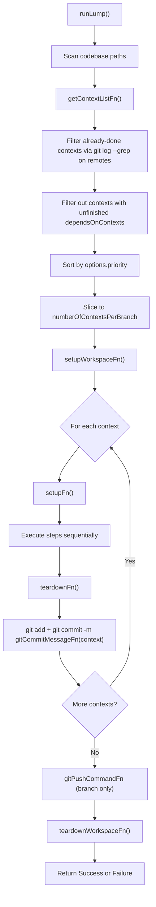

# @lumpcode/core

The core engine of Lumpcode, mainly exporting the `runLump` function.

`runLump` drives one **agent loop** over a context list in a single invocation. Each context is a unit of work (often a file or a logical group of files). Lumpcode scans your codebase, builds a list of contexts, filters out those already completed (each completed context is materialized as exactly one normalized commit on a remote branch), then runs your prompts on the rest, managing git branches and commits and tracking progress via normalized commit messages.

**Agent loop campaigns** (`.lumpcode/lumps/` configs, daemon scheduling, `lump-status`, `clean`) are CLI-only. Core runs one agent loop per `runLump` call; use your own scheduler or the CLI to manage campaigns.

`runLump` is very configurable but comes with sensible default behaviors.

> **Important:** `@lumpcode/core` is the engine only. For **agent loop campaign** management (project bootstrap, `.lumpcode/lumps/` configs, background daemon, status, and cleanup), use the [Lumpcode CLI](../apps/cli/README.md) (`npm install -g @lumpcode/cli`).

## Installation

```bash
npm install @lumpcode/core
```

## Quick Start Example

```typescript
import { runLump } from "@lumpcode/core";

const runResult = await runLump({
  projectRoot: "/path/to/a/copy/of/your/project",
  baseBranch: "main",

  getContextListFn({ codeBasePaths }) {
    return codeBasePaths
      .filter(({ isDir, path }) => !isDir && path.endsWith(".ts"))
      .map(({ path }) => ({
        name: path.replaceAll("/", "_").replaceAll(".", "_"),
        variables: { FILE: path },
      }));
  },

  branchFn({ contextList }) {
    return `lump-rules-refactor/${contextList[0].name}`;
  },

  steps: [
    {
      promptFn: ({ context }) =>
        `Refactor @${context.variables.FILE} following all project rules`,
      commandFn: ({ prompt, stepVariables }) => ({
        executable: "claude",
        args: ["-p", prompt, "--model", stepVariables.model],
      }),
      stepVariables: {
        model: "claude-sonnet-4-6"
      },
    },
  ],
});

if (runResult.success) {
  // result.data.result: { branchName, contextNames, contextRunStateList }
  console.log("Done:", runResult.data.result);
} else {
  console.error("Failed:", runResult.data.message);
}
```

## Key Concepts

### Context

A `Context` represents one unit of work. It has a unique `name` (used to derive the normalized commit message used for tracking) and `variables` (a `Record<string, string>` available in your prompt and command functions). Optional fields in `options` can influence processing order and define dependencies between contexts.

```typescript
interface Context {
  name: string;
  variables: Record<string, string>;
  options?: {
    priority?: number;
    dependsOnContexts?: string[];
  };
}
```

- `**priority**` — Lower values are processed first. Defaults to `0`.
- `**dependsOnContexts**` — Context names that must be `finished` before this context is eligible. If any dependency is still `toDo` or `branchPushed`, the context is excluded from the current batch. Core resolves each entry marker commit with your `gitCommitMessageFn`. The [Lumpcode CLI](../apps/cli/README.md) can wire **cross-lump** dependencies between lumps in the same project — see [CLI lump config](../apps/cli/DOCS/lump-config.md#context-ordering-and-cross-lump-dependencies).

### CodeBasePath

The shape of each entry returned when scanning the project's file tree. Your `getContextListFn` receives an array of these and maps them into contexts.

```typescript
interface CodeBasePath {
  isDir: boolean;
  path: string;
}
```

### ContextRunState

A mutable `Record<string, unknown>` that persists across prompt executions within a single context. Initialize it in `setupFn` and read/write it from `promptFn`, `commandFn`, or `postCommandExecFn`.

### Steps

An array of `Step` objects that are executed sequentially for each context. Each `Step` groups the following fields:


| Field               | Type                            | Description                                                                                                                                                                                                                             |
| ------------------- | ------------------------------- | --------------------------------------------------------------------------------------------------------------------------------------------------------------------------------------------------------------------------------------- |
| `promptFn`          | `PromptFn | undefined`          | Optional. Generates the prompt string from the current context, run state, and variables. When omitted, `commandFn` receives an empty prompt string.                                                                                    |
| `commandFn`         | `CommandFn`                     | Required. Returns `{ executable, args, env? }` to run a subprocess, or `null` / `undefined` to skip execution while still running `postCommandExecFn`. Optional `env` merges over the parent process environment for that command only. |
| `stepVariables`     | `StepVariables | undefined`     | Optional extra variables passed into `promptFn`, `commandFn`, and `postCommandExecFn`.                                                                                                                                                  |
| `postCommandExecFn` | `PostCommandExecFn | undefined` | Optional hook called after the command finishes, receiving the command output.                                                                                                                                                          |
| `timeoutMillis`     | `number | undefined`            | Maximum time in milliseconds allowed for the command execution. Defaults to `1800000` (30 minutes).                                                                                                                                     |


Elements in the array can also be **functions** that return more `Steps` at runtime, enabling dynamic and recursive prompt chains. See [Recursive Steps](#recursive-steps) for details.

## Basic Parameters

**Required**

#### `projectRoot`

**Type:** `string`

Absolute path to the root of the project Lumpcode will operate on. This directory is scanned to build the list of `CodeBasePath` entries.

We recommend pointing `projectRoot` to a **separate copy** of your project rather than the directory you are manually working in, so that Lumpcode's git operations don't interfere with your own work. Where prompts and git commands actually run is determined by `[setupWorkspaceFn](#setupworkspacefn)` (see `workspacePath` there). The [Lumpcode CLI](../apps/cli/README.md) handles this isolated copy for you.

#### `baseBranch`

**Type:** `string`

The base git branch to branch off from (e.g. `"main"`, `"dev"`). Lumpcode checks out this branch before creating work branches.

#### `getContextListFn`

**Type:** `GetContextListFn`

```typescript
type GetContextListFn = (params: {
  codeBasePaths: CodeBasePath[];
  lumpVariables: LumpVariables;
}) => MaybePromise<ContextList>;
```

Receives the full list of files and directories in the project and returns the `Context[]` representing the units of work. This is where you filter for specific file types, group files, or create contexts from any logic you need.

#### `branchFn`

**Type:** `BranchFn`

```typescript
type BranchFn = (params: {
  contextList: Context[];
  contextRunStateList: ContextRunState[];
  lumpVariables: LumpVariables;
}) => MaybePromise<string>;
```

Generates the git branch name for a batch of contexts. Called once per branch.

#### `steps`

**Type:** `Steps`

The array of prompt items (or dynamic prompt-generating functions) to execute for each context. See the [Steps](#steps) section above for the full shape.

**Optional**

#### `numberOfContextsPerBranch`

**Type:** `number` -- **Default:** `1`

How many contexts to include in a single branch. For example, `1` means each context gets its own branch; `5` groups up to five contexts per branch.

#### `logger`

**Type:** `Logger` -- **Default:** `createConsoleLogger({})` when omitted

Optional operational logger. CLI callers should pass an explicit logger from `createCliLogger` (after OR-merging lump `verbose` with `--verbose`). Library callers omit it for quiet defaults (info/warn/error only, no verbose detail).

See [Logging](#logging) below.

#### `getKeepHistoryFilePathFn`

**Type:** `(context: Context) => string | undefined` -- **Default:** `() => undefined`

When this function returns a non-empty path for a context, the engine appends one JSON object per prompt step (after each successful agent command) to that file. The file is a JSON array; each element has the same shape as `postCommandExecFn` input (`commandResult`, `commandSucceeded`, `context`, `prompt`, `stepIndex`, `contextRunState`, `lumpVariables`, optional `stepVariables`, `projectRoot`). Parent directories are created with `mkdir(..., { recursive: true })` before the initial `[]` write.

The Lumpcode CLI sets this from lump config `**keepHistory: true`**, writing to `.lumpcode/lumps/<lumpName>/history/<contextName>.json`. Library callers can supply a custom function for other paths or naming.

## Advanced Parameters

All advanced parameters are optional and have sensible defaults. Override them when you need custom lifecycle hooks, git behavior, or workspace management.

### `lumpVariables`

**Type:** `Record<string, unknown>` -- **Default:** `{}`

Custom variables that are passed through to every callback (`getContextListFn`, `branchFn`, `promptFn`, `commandFn`, etc.). Use this to share configuration across all stages without relying on closures.

### `setupFn`

**Type:** `SetupFn` -- **Default:** returns `{ contextRunState: {} }`

```typescript
type SetupFn = (params: {
  contextList: Context[];
  lumpVariables: LumpVariables;
  currentContextIndex: number;
}) => MaybePromise<Maybe<Partial<{
  contextRunState: ContextRunState;
}>>>;
```

Called before each context is processed. Use it to initialize the `contextRunState` or perform any per-context preparation.

### `teardownFn`

**Type:** `TeardownFn` -- **Default:** no-op

```typescript
type TeardownFn = (params: {
  lumpVariables: LumpVariables;
  contextList: Context[];
  contextRunState: ContextRunState;
  currentContextIndex: number;
}) => MaybePromise<void>;
```

Called after each context finishes. Use it for cleanup or logging.

### `gitCommitMessageFn`

**Type:** `GitCommitMessageFn` -- **Default:** ``LUMP:${context.name}``

```typescript
type GitCommitMessageFn = (input: {
  context: Context;
  lumpVariables: LumpVariables;
  baseBranch: string;
}) => string;
```

Maps a context to its normalized git commit message. **The returned message must be unique per context** -- it is the source of truth used to track whether a context has already been processed (see [Context Tracking with Git Commits](#context-tracking-with-git-commits)).

### `gitAddCommandFn`

**Type:** `GitAddCommandFn` -- **Default:** `git add .`

Customize the git add command. Receives `{ baseBranch, branchName, contextList, workspacePath, context }` and is invoked **once per context**, right before that context's commit.

### `gitCommitCommandFn`

**Type:** `GitCommitCommandFn` -- **Default:** ``git commit -m "${commitMessage}"``

Customize the git commit command. Receives the same input as `gitAddCommandFn` plus `{ commitMessage }`. Invoked **once per context**, producing exactly one commit per context on the work branch.

### `gitPushCommandFn`

**Type:** `GitPushCommandFn` -- **Default:** ``git push origin ${branchName}``

Customize the git push command. Invoked **once per branch**, after all per-context commits are made.

### `setupWorkspaceFn`

**Type:** `SetupWorkspaceFn` -- **Default:** checkout-based setup

Prepares the workspace before prompt execution. It returns an object with two fields:

- `command` — the shell command to run (e.g. checkout the base branch, fetch, create the work branch).
- `workspacePath` — the directory where all subsequent operations (prompt execution, git add/commit/push) will take place. The default implementation returns `'.'`, so those commands run with `cwd: '.'` (the **host process's current working directory**). If your process's cwd is not `projectRoot`, pass an absolute path (e.g. `projectRoot` or a worktree path) so behavior is unambiguous.

> **Where commands run:** `setupWorkspaceFn` is the only function whose returned `command` runs at `projectRoot`. All other function parameters that return commands (`gitAddCommandFn`, `gitCommitCommandFn`, `gitPushCommandFn`, `commandFn`, `teardownWorkspaceFn`) execute their commands at `workspacePath`.

The default implementation command checks out the base branch, fetches, pulls, deletes and re-creates the work branch (with `cwd: projectRoot` for this setup command only):

```bash
git switch <baseBranch>;
git reset --hard origin/<baseBranch>;
git fetch --all;
git pull origin <baseBranch>;
git branch -D <branchName>;
git switch -c <branchName>;
```

An alternative **git-worktree-based** implementation is exported as `defaultSetupWorkspaceFnWithWorktree` for parallel workspace isolation.

### `teardownWorkspaceFn`

**Type:** `TeardownWorkspaceFn` -- **Default:** `git switch <baseBranch>`

Cleans up the workspace after all contexts on a branch are done. The default switches back to the base branch only. A worktree variant is exported as `defaultTeardownWorkspaceFnWithWorktree`.

## Logging

Operational runtime output uses a small shared `**Logger`** type exported from `@lumpcode/core`:

```typescript
type Logger = {
  error: (message: string) => void;
  warn: (message: string) => void;
  info: (message: string) => void;
  verbose: (message: string) => void;
  child: (prefix: string) => Logger;
};
```

- `**createConsoleLogger({ verbose?, json?, prefix? })**` — console-backed implementation (`error` always prints; `verbose` gated by `verbose`; when `json: true`, non-error levels are suppressed).
- `**noopLogger**` — no-op logger for tests.
- `**formatExecFailureMessage({ label, failure })**` — user-facing shell/git failure strings.

Pass `**logger**` on `RunLumpInput`. When omitted, the engine uses `createConsoleLogger({})` (operational errors/warnings/progress only; no verbose detail unless the logger you pass enables it).

## Return Value

`runLump` returns a `Promise` that resolves to a discriminated union:

```typescript
Promise<
  | Success<{
      result: {
        branchName: string;
        contextNames: string[];
        contextRunStateList: ContextRunState[];
      };
    }>
  | Failure<{ message: string }>
>
```

Check the `success` field to discriminate:

```typescript
const result = await runLump({ ... });

if (result.success) {
  const { branchName, contextNames, contextRunStateList } = result.data.result;
} else {
  console.error(result.data.message);
}
```

## Recursive Steps

`Steps` is a recursive type. Each element is either a concrete `Step` or a **function that returns another `Steps` array**:

```typescript
type Steps = Array<
  | Step
  | ((input: PromptFnInput) => MaybePromise<Steps>)
>;
```

When the engine encounters a concrete `Step`, it runs optional `promptFn`, then `commandFn`, then `postCommandExecFn` (if provided). When `commandFn` returns `null`, `undefined`, or nothing, the subprocess is skipped and `postCommandExecFn` still runs with an empty `commandResult`. When it encounters a **function**, it calls it and recursively executes the returned `Steps` before moving to the next element. The returned array can itself contain more functions, allowing arbitrary nesting depth. An empty returned array is a no-op.

This makes it possible to build dynamic prompt chains: a function can inspect the current context, run state, or variables and decide at runtime how many prompts to produce, what they contain, or whether to skip entirely by returning an empty array.

`stepIndex` uses a **smart union** in every callback (concrete `promptFn` / `commandFn` / `postCommandExecFn` **and** function-form prompt items): at the top level it is a plain `number` (`0`, `1`, `2`, … — same as the item's position in the root `steps` array). When an item runs **inside** a nested array produced by a function-form parent, it is a `number[]` path from the root (e.g. a function-form item at root index `1` receives `1`; the items it returns receive `[1, 0]`, `[1, 1]`, …; and a function nested at `[1, 0]` would itself receive `[1, 0]`).

**Example:** a static first prompt, a dynamic middle section, and a static final prompt:

```typescript
const steps: Steps = [
  // Index 0 -- always runs
  {
    promptFn: ({ context }) =>
      `Analyze @${context.variables.FILE}. If it needs refactoring, return just TRUE.`,
    commandFn: ({ prompt }) => ({
      executable: "claude",
      args: ["-p", prompt],
    }),
    stepVariables: {},
    postCommandExecFn: ({ commandResult, contextRunState }) => {
      contextRunState.needsRefactor = commandResult.includes("TRUE");
    },
  },

  // Index 1 -- dynamic: returns 0-N sub-prompts at runtime
  ({ context, contextRunState }) => {
    if (contextRunState.needsRefactor) {
      return [
        {
          // Index [1, 0]
          promptFn: () => `Refactor @${context.variables.FILE}`,
          commandFn: ({ prompt }) => ({
            executable: "claude",
            args: ["-p", prompt],
          }),
          stepVariables: {},
        },
        {
          // Index [1, 1]
          promptFn: () =>
            `Verify the refactoring @${context.variables.FILE} is well done`,
          commandFn: ({ prompt }) => ({
            executable: "claude",
            args: ["-p", prompt],
          }),
          stepVariables: {},
        },
      ];
    }
    return []; // skip this step
  },

  // Index 2 -- always runs
  {
    promptFn: ({ context }) => `Write tests for @${context.variables.FILE}`,
    commandFn: ({ prompt }) => ({
      executable: "claude",
      args: ["-p", prompt],
    }),
    stepVariables: {},
  },
];
```

## Context Tracking with Git Commits

Lumpcode uses normalized git commit messages to record which contexts have already been processed. Each completed context contributes **exactly one commit** whose subject equals `gitCommitMessageFn({ context, ... })`. On every subsequent call to `runLump`, contexts whose normalized commit message is already present on a remote branch are skipped so the run only works on what remains. This lets you call `runLump` repeatedly (e.g. in a cron job) and each invocation picks up where the previous one left off, progressively working through the full context list without ever re-processing a context.

> If you'd rather not wire up your own scheduler, the [Lumpcode CLI](../apps/cli/README.md) ships a built-in daemon (`lumpcode start`) that calls `runLump` on a tick, with concurrent-branch limits and per-lump enable/disable already wired in.

### Commit message naming

By default, a context named `my_component_ts` produces a commit with the subject:

```
LUMP:my_component_ts
```

You can customize this via the `[gitCommitMessageFn](#gitcommitmessagefn)` parameter. The returned subject **must be unique per context** -- it is the only thing tying the commit back to its context.

### Context statuses

CLI users: marker format is `LUMP: <lumpName> - <contextName>` — see [concepts.md](../apps/cli/DOCS/concepts.md).

When filtering contexts, Lumpcode resolves each context's normalized commit message to one of three statuses:


| Status         | Meaning                                                                                              | Effect                                                     |
| -------------- | ---------------------------------------------------------------------------------------------------- | ---------------------------------------------------------- |
| `toDo`         | No commit with the context's normalized message exists on any remote ref.                            | Will be processed (unless blocked by `dependsOnContexts`). |
| `branchPushed` | A commit with the context's normalized message exists on a remote branch other than the base branch. | Skipped.                                                   |
| `finished`     | A commit with the context's normalized message is reachable from `origin/<baseBranch>`.              | Skipped.                                                   |


A context with `dependsOnContexts` is only eligible when **all** of its listed dependencies have the `finished` status. This means the dependency's commit must be reachable from the remote base branch. Contexts stuck at `branchPushed` do not satisfy the dependency.

### Useful git commands for context tracking

**List all lump commits across remote branches:**

```bash
git fetch --all
git log --remotes=origin --grep="^LUMP:" --format='%H %s'
```

**Check if a specific context has been processed (any remote ref):**

```bash
git log --remotes=origin -F --grep="LUMP:my_component_ts" --format='%H'
```

(`-F` makes `--grep` a literal string match.)

**Check if a context is `finished`** (commit is reachable from the remote base branch):

```bash
hash="$(git log --remotes=origin -F --grep='LUMP:my_component_ts' --format='%H' -n 1)"
git merge-base --is-ancestor "$hash" origin/main && echo "finished" || echo "not finished"
```

**Check which remote branches contain a context's commit** (`branchPushed` state):

```bash
git branch -r --contains "$(git log --remotes=origin -F --grep='LUMP:my_component_ts' --format='%H' -n 1)" --format='%(refname:short)'
```

**Reset a single context** by re-creating an empty marker commit on the remote base branch (so it counts as `finished`):

```bash
git commit --allow-empty -m "LUMP:my_component_ts"
git push origin main
```

To genuinely re-process a context, delete the work branch holding its commit (after which the commit becomes unreachable from any remote ref and the context flips back to `toDo`):

```bash
git push --delete origin <branch-containing-the-commit>
```

## How It Works




